### 前言
NoSQL、尤其是key-value NoSQL在日常开发中扮演了非常重要的角色，除非对于关系型数据或者事务之类的有着非常强的诉求，不妨就根据业务特点试一下NoSQL，现在市面上的NoSQL非常多，比如说 Redis、Tair、Rockes DB、MongoDB等，每种都有自己的特点。
本篇文章就K-V的NoSQL数据库展开描述，对于常用的Redis、LevelDB、Tair、美团KV实战等进行分析，在高可用、性能优化方面这些它们都做了哪些事情，我们之后应该如何做技术选型和设计，从这些组件中能得到哪些优秀共性。
### Redis
Redis大家应该非常非常熟悉了，相对于memcache提供了更加丰富的数据结构支持，持久化措施也做的相对完备，集群方案也尽可能的解决了可用性等问题。
#### Reids基础实现
先来看Redis的基础，对外提供单key、链表、set、Hash、大数、经纬度等多种数据接口及相关的API，并且支持Lua脚本，能够灵活的实现复合操作的原子性，简单逻辑可以直接基于Redis+lua进行编程，比较舒服。
Redis本身可以理解为是一个大Hash，内部实现了SDS、ziplist、quicklist、hashtable等多种高效的数据结构，在提供丰富数据API的基础上进一步保证性能。
网络连接处理方面Redis也是一个非常经典的Reactor式网络应用，并没有像memcache直接使用了libevent这样的库，而是直接裸写的epoll（默认水平触发、也可配置为边缘触发），比起libevent更加简单了，并且除了持久化线程Redis完全是单线程来搞的。
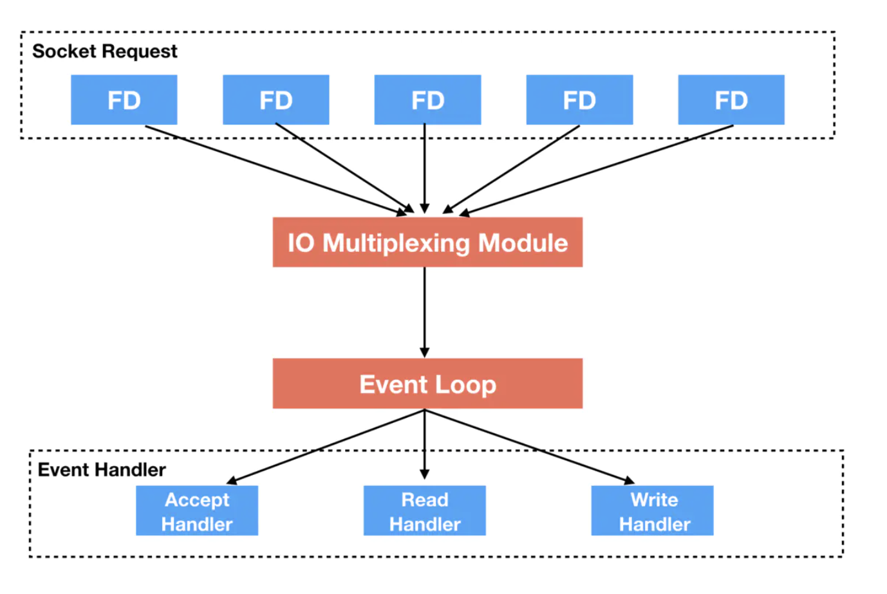
```shell
wget http://download.redis.io/releases/redis-4.0.1.tar.gz
tar -zxvf redis-4.0.1.tar.gz
vim src/server.c
ll ae*.h/cpp
```
具体可以看一下我之前写的redis系列文章。
##### 关于epoll
关于边缘触发、水平触发这里也单独说一下，后面会多次提到：
边缘触发：
读缓冲区状态变化时, 读事件触发。写缓冲区状态变化时, 写事件触发。（只会提示一次）
accept新的连接, 同时监听读写事件，读事件到达, 需要一直读取数据, 直到返回EAGAIN，写事件到达, 无数据处理则不处理, 有数据待写入则一直写入，直到写完或者返回EAGAIN。
效率较高，不需要频繁开启关闭事件。编程比较复杂，处理不当存在丢失事件的风险。
水平触发：
读缓冲区不为空时, 读事件触发。写缓冲区不为满时, 写事件触发。
也就是accept新的连接, 监听读事件，读事件到达, 处理读事件。需要写入数据, 向fd中写数据, 一次无法写完, 开启写事件监听，写事件到达, 继续写入数据, 写完后关闭写事件。
编程简单，大量数据交互时会存在频繁的事件开关，所以相对边缘触发性能较低。
关于这两种epoll的模式不同的应用选择是不同的，也跟其定位相关：Redis-默认水平触发、nginx-边缘触发、go net 边缘触发、Java NIO-水平触发、Netty-边缘触发。
##### 持久化
回到正题，Redis支持RDB、AOF持久化两种，当然了你也可以选择两种一起搞也就是混合持久化。
RDB说白了就是拉内存快照，然后持久化到内存中，是fork一个子进程来做这件事儿（这里会有一个新的线程出现），很显而易见拉快照并保存的期间的发生的数据变化是没办法记录的，但是RDB这种方式恢复速度相对较快。
AOF是通过记录操作命令来进行持久化的，并且其中做了一些类似于命令合并的优化，体积相对RDB较大，并且AOF命令一多恢复时间会无比漫长。
最优的就是RDB记录内存快照，AOF记录RDB期间发生的命令，以此进行数据重演是最合适的。
#### 分布式方案
高可用对于一个系统来说往往是最重要的衡量标准之一，而做高可用最简单的方式就是挂主从，然后在主从的基础上做自动检查和更替，redis就是这么搞的。
对于分布式系统而言，想突破处理极限，做数据分片是肯定的，有水平分也有垂直分，而对于Redis这种key-value的NoSQL数据库毫无疑问内部是水平分片（如何做水平切分就引入了一致性hash等问题，想自定义切分规则就有了hashtag等标示）
redis常见的集群方案有：碗豆浆codis方案、redis-cluster方案。
##### 豌豆荚 codis方案
中心化配置存储，proxy那一层控制分片规则
codis-ha实时监测proxy的运行状态，如果有异常就会干掉，它包含了哨兵的功能（会依赖于类似k8s pod的功能，自动拉起）
codis-ha在Codis整个架构中是没有办法直接操作代理和服务，因为所有的代理和服务的操作都要经过dashboard处理
在Codis中使用的是Zookeeper来保存映射关系，由proxy上来同步配置信息，其实它支持的不止zookeeper，还有etcd和本地文件
Server group中包含了主从节点
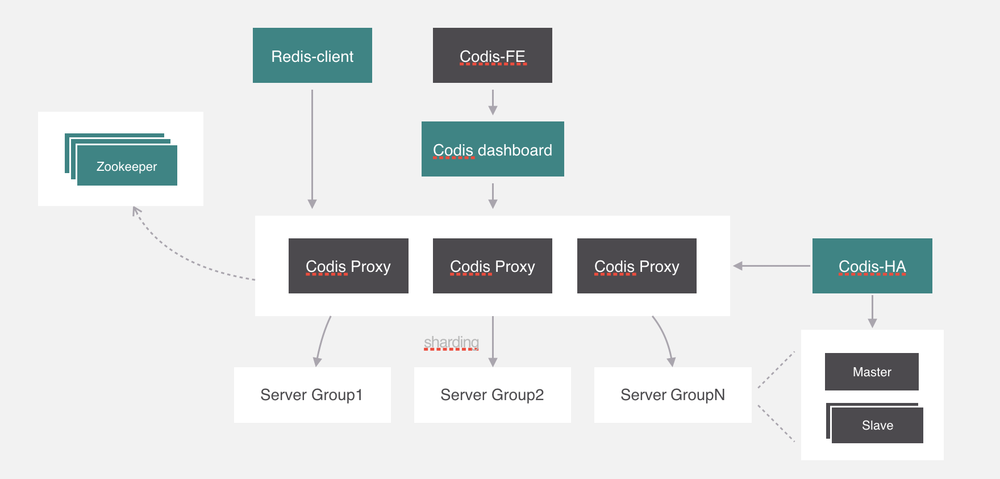
codis是支持动态不停机扩容的，其实就是一个节点打标、历史数据rehash的过程，中间会涉及老hash值与新hash值请求转发的过程。
##### redis-cluster方案
Redis-cluster是去中心化的没有代理，所以只能通过客户端分片。
槽跟节点的映射关系保存在每个节点上，每个节点每秒钟会ping十次其他几个最久没通信的节点，其他节点也是一样的原理互相PING ，PING的时候一个是判断其他节点有没有问题，另一个是顺便交换一下当前集群的节点信息、包括槽与节点映射的关系等。
客户端操作key的时候先通过分片算法算出所属的槽，然后随机找一个服务端请求。
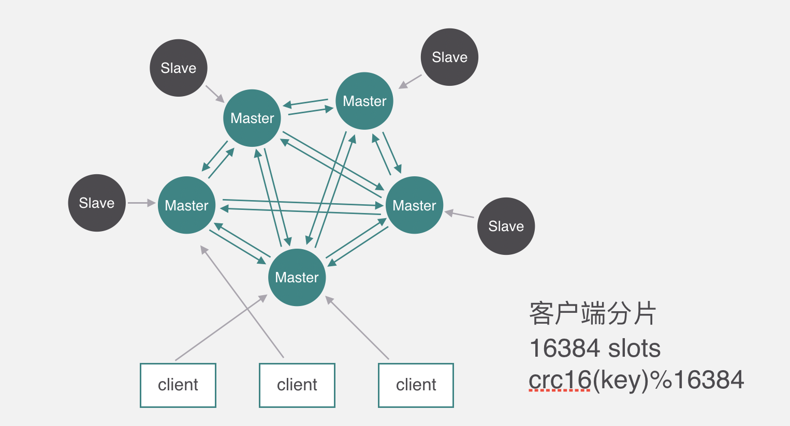
图片来源于：https://www.cnblogs.com/pingyeaa/p/11294773.html
##### 一致性Hash
解决分布式系统中负载均衡的问题时候可以使用Hash算法让固定的一部分请求落到同一server上，这样每台server固定处理一部分请求，起到负载均衡的作用，但是普通的余数hash伸缩性较差（新增或者减少server时映射关系会变），所以需要对Hash算法进行改进实现所谓的一致性Hash
所谓的一致性Hash主要保证Hash算法的
单调性：有新的server加入到系统中时候，应保证原有的请求可以被映射到原有的或者新的server中去，而不会被映射到原来的其它server上去。
分散性：同一个用户的请求尽可能落到同一个服务器上处理
平衡性：是指客户端hash后的请求应该能够相对均匀分散到不同的server上去
为了做到这几点，在引入hash环的思路的基础上有引入了虚拟节点等措施来保证上述特性。
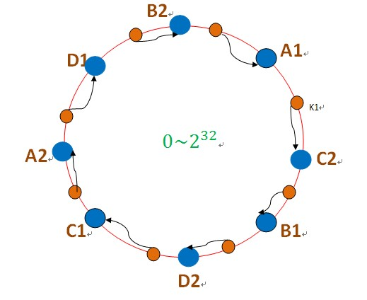
### LevelDB
levelDB是同样也是一个Key-value数据库，但是相对于Redis、memcache来说，levelDB是基于内存-磁盘来实现的，但在大部分场景下也表现出了不逊色于Redis、Memcache的性能。levelDB由google实现并开源，轻松支持billion量级的数据，并且性能没有太大的衰退，下面来看一下LevelDB的具体实现。
#### LevelDB实现
既然是一个key-value 数据库，显而易见支持的api肯定有put／get／delete（delete实质上就是put一个具有删除标的key）等操作，从这三个API入手去看下levelDB的实现：
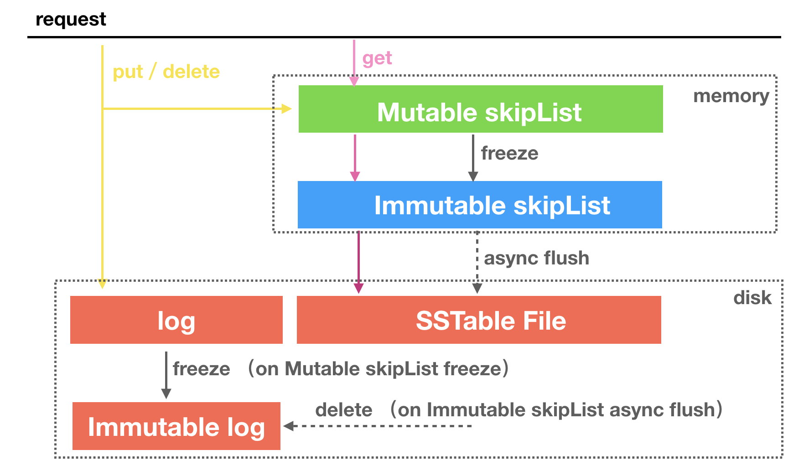
levelDB内部存储分为内存存储及磁盘存储，内存存储的依赖的数据结构是跳跃表（可以粗暴的理解为key有序的set集合，默认字典序），一种查找时可以近似做到log(n)，具备链表的快速增删、数组的快速查找等特性的数据结构。图中Mutable、Immutale实现都是跳表，Mutable是一种支持写入和读取的跳表，Mutable到达一定大小之后会触发冻结操作来产生Immutale（只读），然后Immutale会持久化到磁盘中产生SSTable file（只读），实际上就是一种不断下沉的过程。
跳表中的key是一种复合结构（包含value值）key: <internal_key_size,internal_key<key,sequence,type>,value_size,value>，需要单独说的是sequence，为全局自增序列号levelDB 遇到一个修改操作，全局序列号自动加一。levelDB 中存储了多个版本的value，就是靠这个序列号来标记键值对的版本，序列号越大，对应的键值对越新。
##### put／delete
put／delete操作时写入Mutable，当前Mutable已满会产生一个新的供写入，并且遵循write ahead log的原则，先写入日志后写入Mutable，如果发生机器故障时使用log文件恢复当前Mutable。
##### get
get操作时，先读Mutable（毫无疑问是最新的），然后读Immutale，最后读SSTable file，如果存在多个版本，则选择最新的版本（序列号最大）进行返回。
#### 细说数据下沉
这就是叫levelDB的原因
上面提到了数据下沉的过程，下面来仔细看一下这个过程：
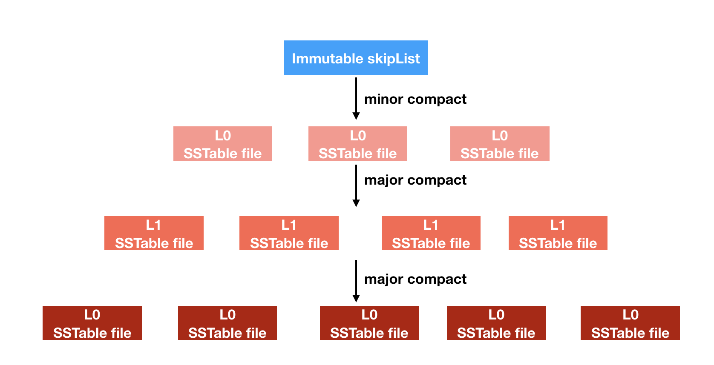
磁盘内的存储结构分为多层，层级的深度同容量成正比：capacity = level > 0 && 10^(level+1) M
由Mutable下沉到L0层（第一层磁盘文件）的过程称为minor compact，这个过程中完全是内存数据直接存储，多个L0 SSTable file 中会出现key值重叠的情况，查找时需要比较版本号。
由n层下沉到n+1层的过程称为major compact， 这个过程会对于上一层的文件进行多路归并操作。
#### levelDB 性能优化上做了哪些事情
##### 数据内存操作
写操作完全基于内存实现，速度无疑会很快，但是相对于Redis来看，由于是多线程或者多协程操作，会存在强锁问题。读操作，热点数据内存中大概率会读到，即使读不到也会有下面“磁盘顺序读写”来进一步保证性能。
但是很显然levelDB是一种适合写多读少的NoSQL数据库。
##### 磁盘顺序读写
磁盘随机读写和顺序读写的性能差异是惊人的，levelDB正是利用了这一点来做的。
随机读写做下差异比较的话，普通磁盘的顺序访问速度跟SSD顺序访问速度差不多一致，远超随机访问的速度（差不多2倍多），甚至能达到内存随机访问的速度（这里举的例子是指SAS磁盘），随机读写相对于顺序读写主要时间花费在循道上，并且顺序读写会预读信息，所以速度自然就差异很大了。
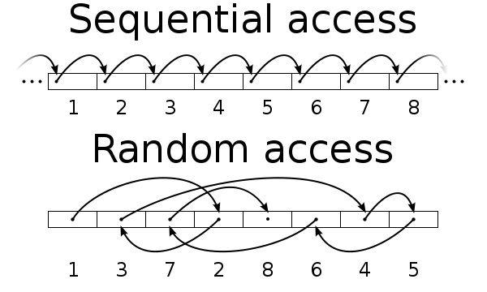
采用这用优化思路的应用有很多，比如Kafka消息文件的追加写入。
##### 精妙的细节
1、跳跃表保证了内存操作的迅速。
2、L0层级以下，分段存储，先找文件后找key。
3、持久化到L0层时，直接拉快照数据，并不做额外操作，L0层以下异步归并下沉
4、当Immutable持久化至磁盘成功时，会删除对应的log文件（减少存储压力）
5、LRU Cache，内存跳跃表中读不到时读缓存，在读SStable文件，尽可能内存操作，由于SSTable文件不会发生变化，大胆缓存。

额外说几句，这里的磁盘顺序写及分层结构，其实本质上就是一种LSM（Log-Structured Merge Tree）存储引擎的思想，解决了B+树随机读的问题，但是对应的也牺牲了一定的读性能，归并操作都是为了优化读性能，类似的还有TSM(Time-Structured Merge Tree），有兴趣可以看一下，比如InfluxDB底层的存储引擎经历了从LevelDB到BlotDB，再到选择自研TSM的过程，TSM其实就是针对LSM引擎文件句柄过多、无TTL机制、减缓删除流量压力等所产生出的一种结构，本质的思想其实还是LSM。
#### levelDB可靠性保证
##### 不丢数据
本着先写日志再写内存的原则，宕机后也能够保证恢复mutable、immutable，所以都是能保证数据不丢的，也就是不会丢失更新。
##### 上锁 & 只读
首先对于Mutable的操作是上锁的，能够保证操作的正确性。Immutable和磁盘文件完全只读，异步归并操作时也都是只读老文件，产生新的文件。
### RockesDB
RockesDB 同样也是一个key-value的NoSQL数据库，如果看Rockes的整体结构与LevelDB基本上是相同的，本质上都是基于LSM实现的key-value存储机制，仅仅是实现差异上不同而已。
相对于LevelDB来说，压缩算法除了level的snappy还增加了zlib,bzip2，数据备份方面支持增量备份和全量备份，支持单进程中启动多个实例，可以有多个memtable，解决put和compact的速度差异瓶颈，内存中数据结构出了之前的跳跃表，还支持了hash+list、hash+skiplist两个结构。
这个可以简单粗暴的理解为LevelDB的加强版吧，Rockes 没有太过深入的学习过，所以只说了下我对它当前的认知，最核心的还是LSM思想和LevelDB的实现思路。
性能上还会有一定的差异，这个没有验证过，不敢下结论。
### memchache
Memcached是一种基于内存的key-value存储，用来存储小块的任意数据（字符串、对象），整体来看memcache就是一种分布式内存对象缓存系统，通常用来存储数据库调用、api接口调用、页面渲染属性的缓存。
memcache的实现相对简单，主要表现为协议简单、命令简单、内部数据结构简单，memcache也相对高效，主要表现为基于libevent的事件处理模型（对于select、poll、epoll支持相对完备，熟悉C++的同学对其应该相对熟悉）、完全基于内存处理，关于memcache的使用可以直接看一下https://www.runoob.com/Memcached/Memcached-tutorial.html 菜鸟教程。
详细说一下libevent，libevent可以简单粗暴的理解为一个C++的网络编程库（对比Java的netty、Go的net），在libevent的基础上就不用手撸epoll了，memcache的libevent的默认模式跟nginx的网络连接处理比较类似，起一个主线程监听并建立连接，然后每个核心绑定一个work线程用于处理数据任务，这也是网络并发编程最常用的模式。因为多线程本身并不会降低时延，并且会额外带来一部分系统开销，主要用于充分提升CPU使用的，所以最合适的就是一个核一个线程。

memcache在我的认知范围内并没有什么很经典的高可用方案（通常来说就是挂主从保证可用，然后一致性Hash做分片分摊单服务压力）
### Tair
Tair是由淘宝网自主开发的Key/Value结构数据存储系统，内部支持四种引擎分别是：mdb、rdb、kdb、ldb，分别基于memcached、Redis、Kyoto Cabinet、leveldb开发完成。
Tair是由淘宝网自主开发的Key/Value结构数据存储系统，内部支持四种引擎分别是：mdb、rdb、kdb、ldb，分别基于memcached、Redis、Kyoto Cabinet、leveldb开发完成。
#### 为什么需要tair
整体来看就是编程接口上的抽象，对于原生K-V存储应用的分布式相关方案优化。
1、提供标准的编程接口，切换底层存储引擎时对代码的改动是非常小的，释放人力解决业务问题。
2、当年的redis是不包含sharding解决方案的，而rair看中了这一点帮忙解决了这个问题。
3、相对于原始redis、memcache集群提供了多机架、多数据中心的支持。
4、相对轻量级的中心节点，client对于路由信息的查询是发生在启动时，真正交互时访问cache来获取信息，所以并不依赖于传统意义上的中心节点。
5、更加强大的副本备份功能支持，使用者可以自定义备份数，发生故障，容灾时会自动将请求路由到新表，整个过程对用户透明，服务不中断。
#### tair整体结构
一个Tair集群主要包括3个必选模块：configserver、dataserver和client，一个可选模块：invalidserver。
简单来看就是一种这样的结构：

一个集群中包含2台configserver及多台dataServer。两台configserver互为主备并通过维护和dataserver之间的心跳获知集群中存活可用的dataserver，构建数据在集群中的分布信息（对照表）。dataserver负责数据的存储，并按照configserver的指示完成数据的复制和迁移工作。client在启动的时候，从configserver获取数据分布信息，根据数据分布信息和相应的dataserver交互完成用户的请求。invalidserver主要负责对等集群的删除和隐藏操作，保证对等集群的数据一致。
#### 性能优化
##### 集成优秀存储引擎
大部分牛逼的开源组件基本都是站在巨人的肩膀上编程，tair也是如此，集成了levelDB、Redis、memcache等优秀存储引擎的特点，在数据存储、IO方面做的都不错。
但是需要注意的是 仅作为存储引擎来使用的，比如redis网络连接处理还有集群方案等不要扯进来。
##### 热点识别 & 横向扩展能力
虽然看上去tair就是在各大优秀存储引擎上面包了一个壳，然后提供了标准的编程接口和k-v解决方案，但是tair对于性能上也是做了一些自己的优化的，其中很经典的一点就是热点数据的识别和专项处理。
但是从业界的测评来看，tair-rdb分布式解决方案基本是比redis分布式方案性能慢1/5左右的，与网络IO处理有关。
当几个key出现热点时，而根据hash算法的得到的结果恰巧这几个就在一个server上，很容易拖垮集群中的某个机器甚至集群，但是在电商或者支付领域单热点账户所带来的热点流量可能会非常的常见，对于这类数据tair有一套自己的解决方案：
###### 热点识别
要识别热点，首先要定义热点。
dataServer收到客户端的请求后，由每个具体处理请求的工作线程（Worker Thread）进行请求的统计。工作线程用来统计热点的数据结构均为ThreadLocal模式的数据结构，完全无锁化设计。热点识别算法使用精心设计的多级加权LRU链和HashMap组合的数据结构，在保证服务端请求处理效率的前提下进行请求的全统计，支持QPS热点和流量热点（即请求的QPS不大但是数据本身过大而造成的大流量所形成的热点）的精准识别。
大家百度一下tair热点定义的方式，多半会出现如下公式：
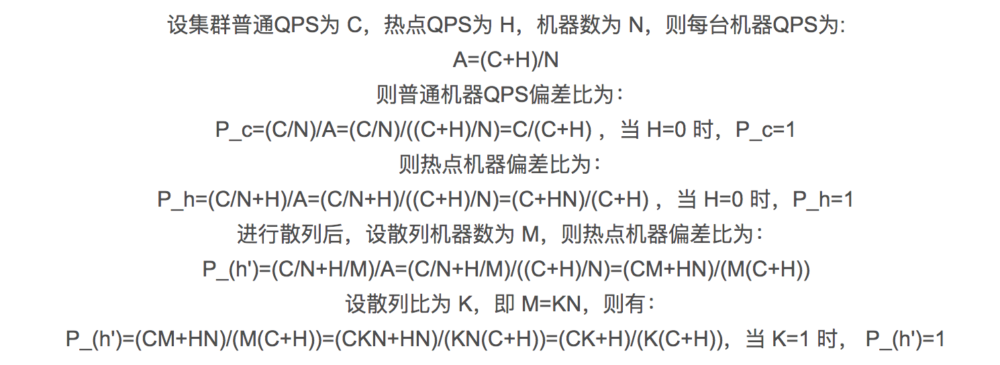
###### 多级缓存&热点专项处理
对于读热点来说，我们要处理的其实就是IO压力、内部数据处理压力，对于网络IO的处理tair选择使用专用线程处理热点IO连接，在保证效率充分发挥CPU使用率的同时尽可能不影响到其他的key的处理，对于内部处理压力，tair专门为热点Key做了缓存，先访问内部缓存如果没有命中再去真正的数据源。并且每台机器的热点数据存储都是相同的，对于热点数据的压力相当于就分摊到了各个机器上，一定程度上来看，读热点的key做到了横向扩展。
对于写热点来说，采用的是微批处理的思路，合并写入。
所以Tair 的整体架构就变成了这样：
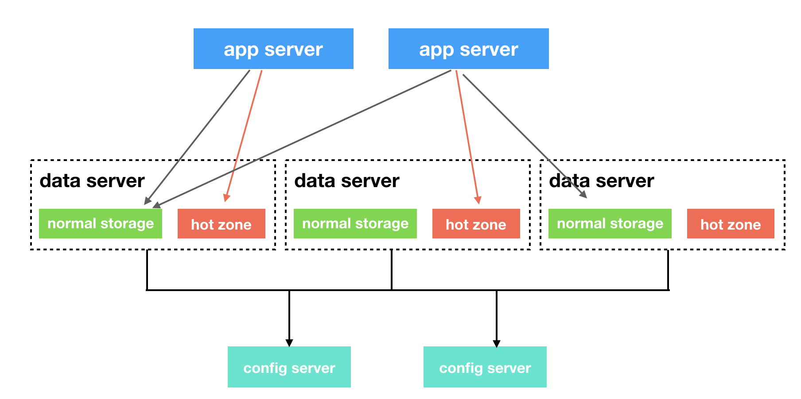
#### 可靠性提升
先说缺点，中心节点虽然是主备高可用的，但实际上它没有类似于分布式仲裁的机制，所以在网络分割的情况下，它是有可能发生“脑裂”的。
##### 多机架和多数据中心的支持
为了更进一步的提高系统存储的可靠性，configserver在构建对照表的时候，可以配置机房和机架信息，这样在配置备份数的时候就可以分不到不同的机房或者机架上，这样就避免了同一个机房或者机架同时故障，容灾可靠性指数级提升，但是这里的特性是需要结点物理分布的支持的。

#### 针对Kyoto Cabinet的简单补充。
memcache、redis、levelDB 上面都已经详细讲过了，那KC（Kyoto Cabinet）是个啥呢？
在看KC之前首先需要知道“DBM”，DBM是一个轻量级的数据库，但是不是标准的数据库，纯粹以二进制存储常用于系统底层的数据库，性能是get操作非常快，但是put操作比较慢，整个数据库就是一个文件，写入时就是整个文件的更新。而KC就可以简单粗暴的理解为是一种DBM。KC底层文件实现支持HASH存储也支持B+树存储，两种实现方式的差异其实就是HASH结构做存储与B+树结构做存储的差异。
B+树：每个操作的时间复杂度是 O(log N)，但由于B+tree支持对key顺序的连续访问，这可以实现对字符串的前向匹配查找和整数的范围查找。
Hash表：每个操作的时间复杂度是 O(1)，数据库的大小小于内存大小，性能表现为内存的速度。
通常外面会包一层tokyotyrant（网络交互协议），这样就能够通过HTTP访问或者memcache协议来访问了，别看很古老很简陋，但是性能也是不错的。
### 美团基于redis cluster的Squirrel方案
该部分资料来源于美团技术团队，这一篇文章写的十分细致，我这里只做几个点描述，大家要了解可以直接去看这篇文章：https://tech.meituan.com/2020/07/01/kv-squirrel-cellar.html
#### 节点容灾
自定义高可用节点，将原生Redis 30秒的鉴别时间缩短为5秒，HA节点负责机器的增减（包括临时抖动或者永久性宕机），进一步缩短了部分key不可用的时间。

#### 跨地域容灾
相对于同地域机房间的网络而言，跨地域专线很不稳定；第二，跨地域专线的带宽是非常有限且昂贵。并且在单元化部署、异地多活架构的背景下，美团做了集群间的复制方案，
这里可以简单的把通过redis复制协议拉数据的集群看作是从集群（从库）
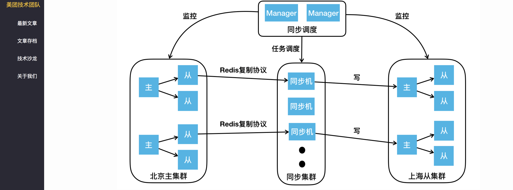
#### 数据迁移
对于新加入节点或者机器迁移方面，美团做了较多的事情，Migrate 命令会阻塞工作线程，对于小key的迁移，通过成功率／相应时间来动态控制迁移速率，在保证成功率的同时尽可能提升速率，维持一种动平衡。
对于大Key的迁移，新增了异步Migrate操作，主线程正常处理流程，命中正在异步迁移的key时直接报错，牺牲小key保全大局。
#### 持久化优化
针对大数据fork子进程时的秒级阻塞、磁盘IO抖动下的AOF对成功率存在影响等问题。
日常不做RDB仅记录BackLog，业务低峰期生成RDB、异步写AOF，会导致关键时刻可靠性下降，但提升了日常抖动时的影响面。
#### 热点优化
对于热点key的处理思路于tair不同，美团采用统计热点后将热点数据统一放置在热点槽点的方式，主要用于热点隔离，并且热点机器的迅速扩容，但是实现方式个人感觉没有tair巧妙（直接在现有存储机器上使用闲置CPU而不是单起机器，热点请求单独控制一定程度上也做了隔离，单个key的热点无法延展）
### 美团cellar方案
该部分资料来源于美团技术团队，这一篇文章写的十分细致，我这里只做几个点描述，大家要了解可以直接去看这篇文章：https://tech.meituan.com/2020/07/01/kv-squirrel-cellar.html
cellar
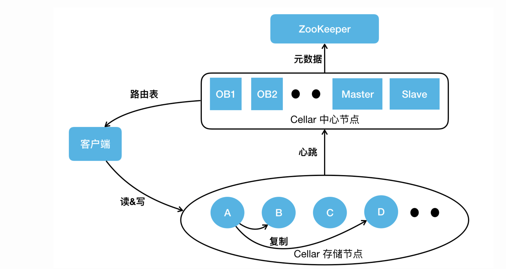
cellar 跟tair的实现思路上是类似的，丰富了一些节点的能力，比如在中心节点与客户端之间新增了一层ob（与ZK的Observer类似 ），把大量的业务请求与集群的大脑做了天然的隔离，防止路由表请求影响集群的管理，并且ob节点能够轻松做水平扩展，并且针对脑裂问题，在中心节点之上架设了zookeeper，保证元数据的高可靠。
这里做的事儿让我想起来前leader经常提到的、软件工程里常说的“加一层能够解决很多问题，也能解决很多问题”，这里cellar做的这些事其实就是根据架构诉求特性加了一层，虽然解决了一些问题，但是响应的架构的复杂度也提升了，我们需要额外的关注ob信息的实时性，增加zk的管理和控制，机器成本相应的增加了（出现故障的概率也会提升）。
#### Cellar 节点容灾
因为集群节点的故障往往是短暂的（机器临时抖动、网络临时抖动等），所以在节点机器上是存有故障前的一部分数据的，如果恢复时做全量的恢复，时间成本是很高的，并且减少了一台实例对于集群来说也是存在较大风险的，所以说如何快速恢复节点并重演数据变的十分重要，这里cellar关注的就是这一点，采用handoff机制来解决的短暂故障带来的影响。
比如当A节点故障之后，中心节点识别到之后，请求根据路由表请求到B节点，B节点对于A故障期间的数据进行写log，当A节点恢复之后，B节点将故障期间的Log回写至A节点，当A节点重演完故障&故障恢复期间所有的数据时，A节点就可以正常处理请求了。
这样除了容灾方面外，我们更容易做节点升级，比如直接摘掉A节点做升级处理，然后触发Handoff机制，升级后回写升级期间的数据即可。
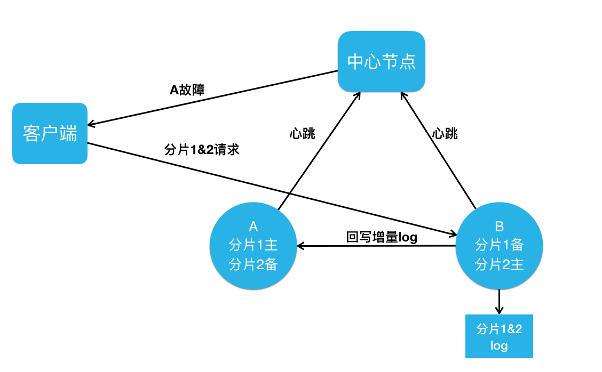
#### Cellar 跨地域容灾
主要是由某一个阶段做数据copy，而不是每个结点都做，这样一定程度上减少了跨城IO专线带宽的占用
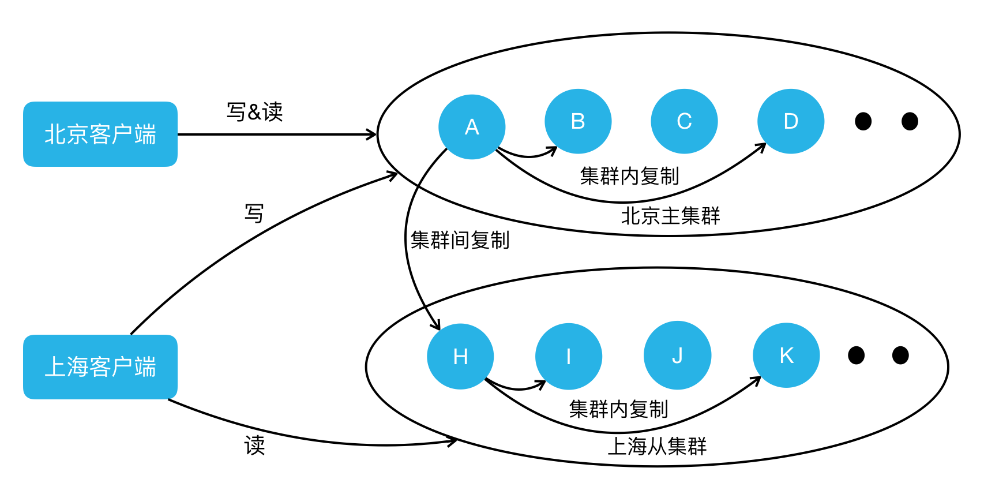
#### Callar 性能优化
##### 快慢队列
针对性能优化话，cellar做了一些事情，最重要的一点就是快慢队列。
由于集群性能和可用性很多时候都是因为某一部分的请求给拖掉的，所以需要将这一部分请求做隔离（这一点跟Tair对于热点key的思路相对类似），根据请求的特点，拆分请求，分发到不同的队列中，由不同的线程进行处理。
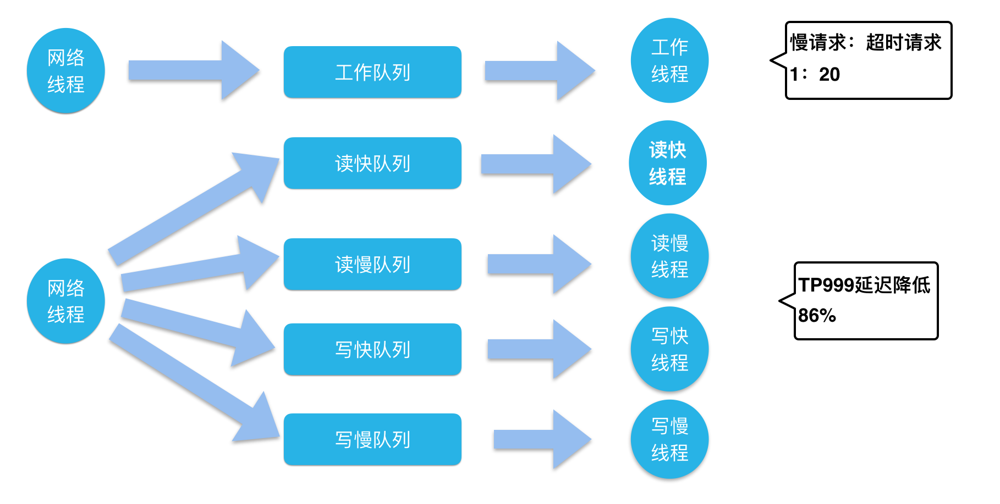
##### 热点key处理
热点key的处理机制跟tair基本一致，server端做缓存（并且同步到每一个结点上）、客户端做缓内存
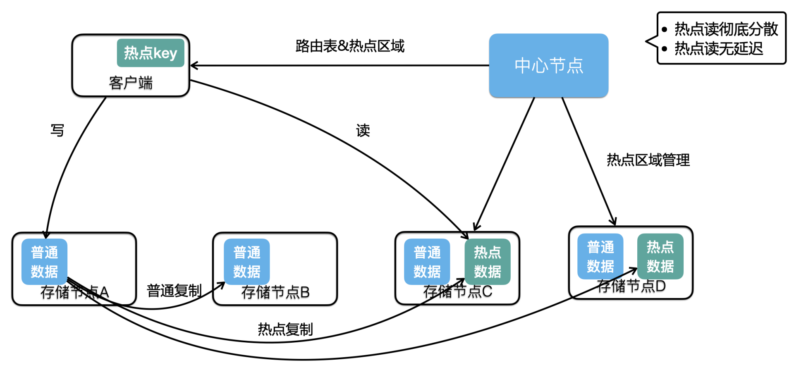
### 后记
整体整体看下来，业界常用的k-v解决方案有 redis系列：codis、cluster方案、美团kv Squirrel方案，Tair系列：tair方案、美团 kv cellar方案，底层的存储常用的有Redis、LevelDB、memcache等。
我们可以根据不同的业务诉求和未来的业务发展趋势选择不同的方案落地，还是相对有选择的，在看这些实现方案的落地过程中也不难总结出一些经验
#### 性能优化方面
1、高效的数据结构真的很管用，如果裸写不到那种程度就用现成高效的组件（比如跳跃表、hash表、LSM、B tree）。
2、网络编程方面，其实就是根据业务场景合理的利用epoll，对大众开发者来看就是合理利用这些对epoll的封装库。
3、微批处理思路可以让系统的吞吐量提升一个数量级（比如kafka mirc-batch、tair合并写入）。
4、热点请求与常规请求分别处理，热点请求挂缓存、做水平切分。
5、合理利用存储：内存>磁盘顺序访问>磁盘随机访问，越贵的存储介质越好。
6、合理的并发模型和并发模型能解决更多问题，线程、协程什么的并不是越多。
7、业务量大就做分片（带来的性价比提升比起单机搞到顶要强很多），并且合理的一致性Hash算法能减少分布式环境下请求的80%的问题。
8、数据复制由点及面，带宽会少很多的，尤其是跨城IO。
9、要根据业务场景选择合适的组件及结构，不要啥都跟风一把梭。
10、业务代码很大程度决定了系统的性能高低，数据最小化原则，并不只在合规之类的场景要用，数据存取也是如此。

#### 高可用方面
1、先上主从、再上HA，基本就能解决大部分问题了。
2、如果存在数据的强一致性诉求或者系统结构中可能存在脑裂问题，paxos之类的搞起来。
3、完善监控、报警机制，自动化做的再完备也会有意想不到的事情发生，有多人工，就有多智能。
4、系统架构尽可能简单，能够满足实际诉求，做到易扩展就做够了，不要给自己找事儿。
5、高保措施要反复考核，通过演练来做而不是理论支撑，认为可能发生的问题就一定会发生，如果是强依赖诉求，节点容灾、跨城容灾这些有条件就搞起来吧。
6、性能优化层面做好，是最大程度的保证可用性的措施，至少不会自己把系统写挂。
7、高可用要从微观和宏观同时来看，保证每个端到端的可用性处理和降级兜底、保证系统可容灾 一样重要。

#### 其他问题
当出现有问题或者诉求解决不了时，就想一想加一层（但是要能cover住加一层所带来的问题）
当出现优化不了的问题时，就看一下其他牛逼的开源组件的实现，思想都是类似的。

就先说这么多吧。