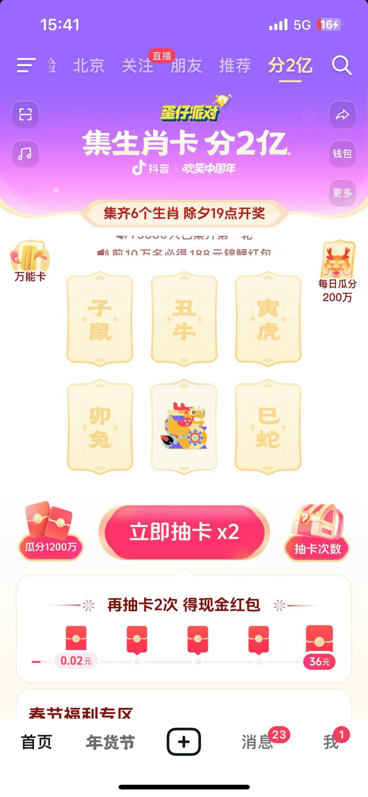
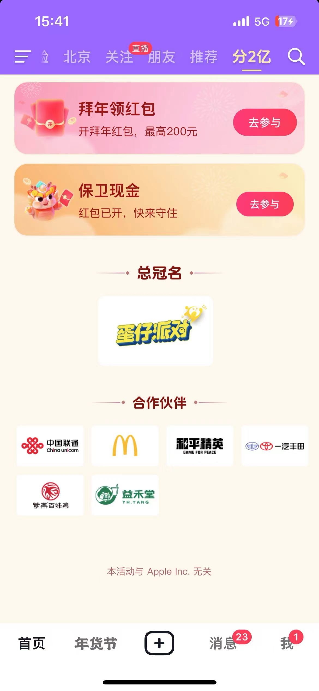

## 抖音

### 主会场
主会场集卡红包 - 全方位覆盖刺激（主打一个步步都有钱，生效主题的年味氛围活动）

估计现金红包策略数量是 百级别的

### 分会场

分会场真的很简单，操作难度极低，说实话参与成本也很低，虽然很多拉人

* 拜年领红包 - 大金额激励 主打站外拉人（玩法相当简单）
* 商城年货节 - 强1888红包：开局红包雨小游戏
* 保卫现金 - 红包打地鼠小游戏（纯粹东校） 主打站外拉人（同样大金额刺激，玩法同样相当简单）
* 内容会场 - 新春直播集（新春演唱会、澳网决赛、飞驰人生宣发、话剧）主打直播、曲艺（这个很有特）、放映厅

| 公司 | 业务               | 玩法种类                                                     | 激励特征                                                     | 活动截图                                                     | 规则概述 |
| ---- | ------------------ | ------------------------------------------------------------ | ------------------------------------------------------------ | ------------------------------------------------------------ | -------- |
| 抖音 | 抖音集团 - 主会场  | 主抽卡玩法： * 集卡瓜分百万 * 指定卡片分千万 * 抽取累计次数必得红包   任务体系： 常规观看视频 - 内容消费 送红包 - 社交体系 + 站外拉人 面对面建群 - 社交体系 + 站外拉人 和朋友AI合照 - 促生产属性的拉人体系（同样推群聊功能） 拍视频 - 促生产 看精彩视频 - 商业化激励广告（估计直接招商营收） 看新春精选视频 - 抖音精品app，孵化产品拉新 & 推广 保卫现金活动 - 其他活动导流位 拜年领红包 - 其他活动导流位  其他会场导流位 均在第三屏：估计是首映就把70%的流量搞定 | 激励特征： 1: 小金额形式 - 步步有激励，主打一个持续反馈 2: 每日机制 - 拉日活 3: 分千万定时参与机制 - 18:30 开奖，拉高峰在线人数 4: 分白粉定时参与机制 - 20:00 开奖，进一步拉高峰在线人数  简单尝试了一些马甲号，背后的金额变化很丰富，估计策略至少是数以百计的。 |  |          |
| 抖音 | 抖音集团- 招财神龙 | 停留页面领奖 + 任务体系 +                                    | 在线时长                                                     |                                                              |          |
|      |                    |                                                              |                                                              |                                                              |          |
|      |                    |                                                              |                                                              |                                                              |          |
|      |                    |                                                              |                                                              |                                                              |          |
|      |                    |                                                              |                                                              |                                                              |          |
|      |                    |                                                              |                                                              |                                                              |          |
|      |                    |                                                              |                                                              |                                                              |          |

|