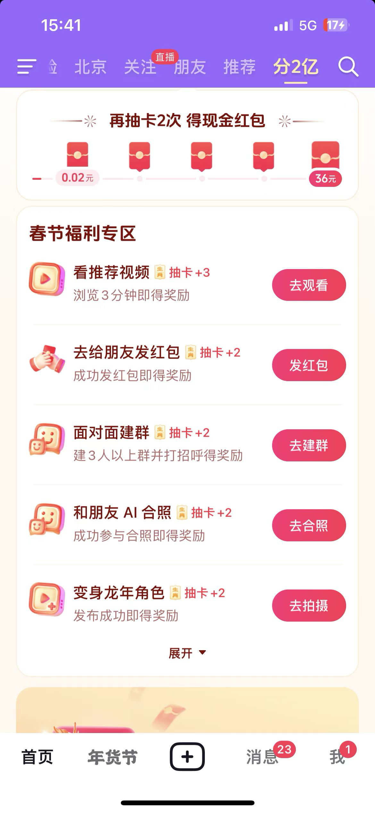
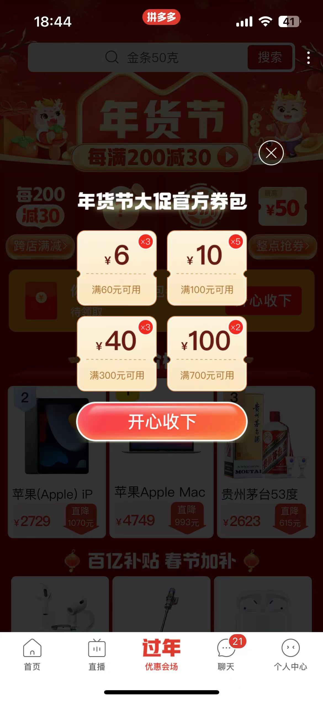
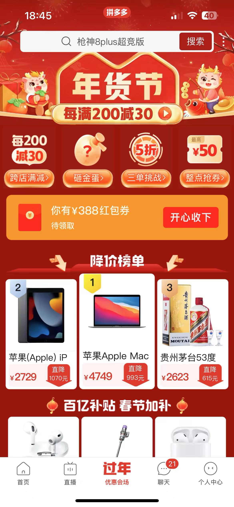
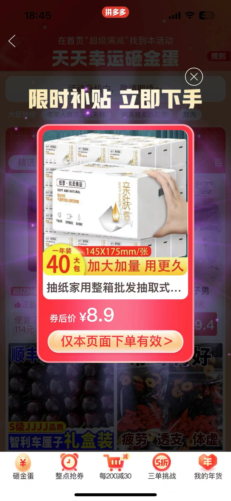
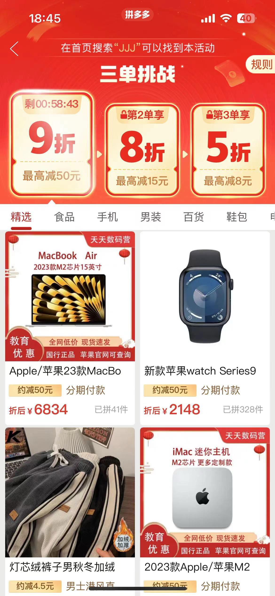

## 1.总结

每年春节都是各大厂活动的高峰期，每年的红包、小游戏、集福、抽奖、新春锦鲤，各样的玩法层出不穷，但是各大厂都有点江郎才尽的意思。今年尝试总结了下各大厂的春节活动，看看各大厂的春节操作。

今年拿到春晚冠名的是京东和小红书，估计除夕夜会有比较大的动作，但是在春节前不到两周的时间内，这两家竟然没发现什么比较大的预热动作。集中精力当晚憋个大的？

除了京东和小红书，我尝试参加了：抖音、淘宝、拼多多、淘宝、支付宝等喜欢做活动的公司，也看了看像微信、美团 这俩不怎么喜欢做春节活动的公司。

抖音做的最精致、支付宝和淘宝 有点粗暴、拼多多还是别具一格的“椰风”、并且拼多多把淘宝带的有些“椰风”，美团和微信一如既往的不喜欢这种场合，美团有些出乎意料，本以为招了这么多内容向的人，今年年底会内容+本地生活来点比较大的活动，结果没等到。

大家对活动的风格不太一样，各家都保持住了自己的风格，甚至你一眼就能猜出这是哪家的活动。但是相较于往年，互联网大厂活动的走势是趋同的，看出来几个大的共性，分享给大家。

以下所有案例、总结，全部为各大产品已公开活动，均来自个人账号的参与，均以个人作为一个用户的视角进行分析，难免偏颇，见谅。

### 1.1 活动玩法``简单化 + 复杂化``

各大厂的活动对于**用户的视角**来看，玩法是逐渐简单化的。比起往年错综复杂的活动规则，今年的活动明显变简单了。

操作路径、用户打工成本、活动逻辑 都变得极其简单，基本都是一眼就知道要干啥。

但是这个简单仅仅是对C体验来说的，活动背后的数值策略，肉眼可见的比往年要高了，更注意活动的受众，更细节的策略区分度。估计背后还会有更实时的数值调配策略。我准备了一些账号，尝试逆向一下背后的规则，发现背后的规则复杂度是探不到底的。

### 1.2 活动 ROI 要求更高

整体春节活动，会场数量比以往更少了，各家基本维持在4、5个会场这样子。整体分钱的数量级也比往年低了1个数量级左右。分20亿、分21亿、分10亿这些字眼基本已经看不到了，更多是分百万、分千万这种。

但满满都是拉人、驻留时长、几点准时打开，大家目标更重了呀。很显然竞争更激烈，而且降本增效要求更高了，而且商业化变现都有点卡脖子的感觉。

把流量、预算用在刀刃上，提升资金效率，基本是大家的共同选择。

所以钱效、资金效率 不再是金融行业的专有名词，这也是为什么活动玩法变简单，数值策略变复杂，这是追求钱效的必然结果。

### 1.3 活动创意到达天花板

活动的玩法创意，已经到天花板了，就那么多玩法，都快玩烂了。

最近在思考一个问题，到底是产品/运营 创意的枯竭，还是降本增效导致的“模版化动作”，毕竟对于创新环境下：效率的提升难度实在太高，成本实在降不下来。

在细分方向，结合具体内容、具体业务做局部创新可能是未来既能保障 “创新”、又能保障“效率”的方法了。

### 1.4 活动整体性 参差不齐

* 抖音的活动整体性做的比较好，各活动之间能相互引导，有种“主-从 即时感”，更像是用n个不同的活动，同时去达成同一个目标。

* 小红书定位做的比较好（谈不上整体性，活动非常简单）

* 淘宝/支付宝目标是一致的，但是各活动相对独立，都为了各自的子目标

* 美团各事业群还是各干各的，过年这种本来也不是什么本地生活热季？就像过年不算旅游季？

这个跟各公司的组织架构有关系，也跟对于春节活动的是什么层面来推进有关系。

活动间冲突/踩脚、资金出现重复支出这个可以理解，但是活动整体分布，及对目标的贡献度、贡献方式，直接决定了活动的效率，背后也就是资金效率。

### 1.5 氛围到达极致

其实除了本次春节系列活动，23年 一直在观察各家的活动玩法演变。主要是两个方向：

* 最「简单」的玩法构建最「有效」的「刺激」：这就是前面说的简单化+复杂化。

比如，单单一个现金被包装成了至少几十种形式：现金抽奖、现金瓜分、锦鲤红包、拉人红包、限时红包、保卫现金、博彩红包、天降红包、任务红包、代币兑换红包等等等等，点一次按钮就给到激励，但是背后的规则是数以千计的。

* 最「精彩」的玩法构建最「极致」的「参与感」，更炫酷的动效、视频、海报，更具备互动性的小游戏等等，主打一个酷炫，提供完整的氛围激励。挑战、养成、对战、协作类小游戏层出不穷。

活动游戏化是一个比较大的趋势，以玩游戏的方式参与活动，进而游戏过程中激励，构成传播、留存等目的，支付宝里面就能看到若干的小游戏，抖音今年虽然没有把小游戏做进来，但是明显有把活动嵌入小游戏的趋势。

### 1.6 营销活动和业务强挂钩

早期的营销活动跟业务的相关性比较差，更多的是独立的品宣、拉新。参加今年的春节活动，最大的感受是 业务、活动已经开始融合了。

比如：

* 活动中的互动途径是年味视频，参与活动帮你生成一条明信片，小红书/抖音的方式
* 活动中下单立享优惠这种，完成游戏挑战，获取大额折扣，支付宝、拼多多、淘宝 这类较多
* 参与购物、浏览视频的时候，穿插商品相关、内容相关的活动等

接下来详细看下各家公司的活动情况，这篇文章是1.28写的。后面各公司有新活动上线 会补充新的文章，有新的发现，随时更新～

## 2.抖音

抖音本次新年活动给人的感觉整体性很好，只是稍微能感受我是在参加好几个活动，不乱，抖音活动几乎上的是最早的。

玩法足够简单、目的明确、激励给人的感受足够大方、分会场同主会场交互联动较多，这是抖音的一大亮点

我从抖音的活动里，感受到了抖音 对C  新产品的全貌：视频、AI、社交、汽水、电商

总结一下：这是一个好玩的app，活动细节打磨的非常好，但是作为用户，感觉是不是稍微有点用力过猛了。

### 2.1主会场
主会场集卡红包 - 全方位覆盖刺激（主打一个步步都有钱，生效主题的年味氛围活动）

现金奖励整体给用户的感受：

1: 玩法现金奖励（主会场） -》直接现金奖励（分会场） 的过渡形式

2: 现金获取难度从易到难，给用户的参与感受 反而是从难到易（这点做的很巧妙）

3: 整体玩法十分流畅，交互/视觉/前端估计精心打磨了

4: 估计现金红包策略数量是 百级别的

### 2.2分会场

分会场真的很简单，操作难度极低，说实话参与成本也很低，虽然很多拉人

* 拜年领红包 - 大金额激励 主打站外拉人（玩法相当简单）
* 商城年货节 - 强1888红包：开局红包雨小游戏
* 保卫现金 - 红包打地鼠小游戏（纯粹东校） 主打站外拉人（同样大金额刺激，玩法同样相当简单）
* 内容会场 - 新春直播集（新春演唱会、澳网决赛、飞驰人生宣发、话剧）主打直播、曲艺（这个很有特）、放映厅

好奇一点，今年抖音电商竟然做的不重，支付竟然也没拉绑卡，月付竟然也没有发力，是因为资源太深我没找到，还是为了整体活动的干净程度和难度。

### 2.3 玩法详细调研

| 公司 | 业务                                      | 玩法种类                                                     | 激励特征                                                     | 首屏                                                         | 二屏                                                         | 三屏                                                         | 冠名                                                         | 核心交互                                                     |
| ---- | ----------------------------------------- | ------------------------------------------------------------ | ------------------------------------------------------------ | ------------------------------------------------------------ | ------------------------------------------------------------ | ------------------------------------------------------------ | ------------------------------------------------------------ | ------------------------------------------------------------ |
| 抖音 | 抖音集团 - 集生效卡（主会场）             | 主抽卡玩法： * 集卡瓜分百万 * 指定卡片分千万 * 抽取累计次数必得红包   任务体系： 常规观看视频 - 内容消费 送红包 - 社交体系 + 站外拉人 面对面建群 - 社交体系 + 站外拉人 和朋友AI合照 - 促生产属性的拉人体系（同样推群聊功能） 拍视频 - 促生产 看精彩视频 - 商业化激励广告（估计直接招商营收） 看新春精选视频 - 抖音精品app，孵化产品拉新 & 推广 保卫现金活动 - 其他活动导流位 拜年领红包 - 其他活动导流位  其他会场导流位 均在第三屏：估计是首映就把70%的流量搞定 | 激励特征： 1: 小金额形式 - 步步有激励，主打一个持续反馈 2: 每日机制 - 拉日活 3: 分千万定时参与机制 - 18:30 开奖，拉高峰在线人数 4: 分白粉定时参与机制 - 20:00 开奖，进一步拉高峰在线人数  简单尝试了一些马甲号，背后的金额变化很丰富，估计策略至少是数以百计的。 |  |  |  |  |  |
| 抖音 | 抖音集团- 招财神龙（第一分会场）          | 炫酷动画参与感 + 时长抽奖 为主玩法（时长利器呀，手机放在哪里就不断的有红包）  目测主要是页面停留时长 + 任务激励体系 + 拉人奖励  任务体系： 同主会场任务几乎一致，但是奖励是分会场内的奖励 任务参与难度不高  规则数量估计也是数以百计的 | 激励特征： 1：小金额激励形式 - 这里主要是时长奖励 + 步步有奖 2: 任务上是直接的现金红包 |  |  |  |                                                              |  |
| 抖音 | 抖音新春直播记 - （第二分会场，内容会场） | 主要是内容导向  看出抖音的内容会唱精心打磨了，用力是一致的  演唱会、曲艺、影视综艺、新春放映厅 萝卜白菜各有所爱，看到曲艺的时候愣了一下  内容很干净，内容却又很充实 - 给我的第一感受 | 无 - 真干净啊  有一个tips 内容会场的banner位是 汽水音乐，汽水音乐有新春演唱会歌单，这个banner的营销可 |  |  |  |  |                                                              |
| 抖音 | 抖音电商-商城好物年货节（第三会场）       | 天降红包雨 - 酷炫的动效，背后是比较扣的奖励 个人认为做的一般，既然主打商城，为什么不把年货给突出出来  从会场跳出来之后，想回到活动，发现回不去了，这是唯一一个主会场跳入分会场回不去的场景。  组织架构影响 产品架构了？ | 激励特征： 1: 适中金额折扣券（满400减6元） 2: 常规电商折扣和电商活动 |  |  |  |                                                              |                                                              |
| 抖音 | 拜年领红包 - 第四分会场                   | 拉人领红包 - 真干净啊                                        | 激励特征： 我就直接告诉你站外拉人给钱，一点没藏着  完全没有那种我玩着玩着就要拉人的厌恶感，想挣钱就拉，不挣钱就这么着  跑马灯细节很亮，能直接拿100块 |  |                                                              |                                                              |                                                              |                                                              |
| 抖音 | 保卫现金 - 第五分会场                     | 变相的拉人给钱  这个活动我没玩懂  活动很贴心，给了活动攻略，但是我研究了3分钟，我还是没玩懂  我差不多做了6年营销活动了，能看出背后的意图，大家玩懂了吗？ 这里如果上一款年兽小游戏，绝对爆火，打地鼠挑战，别踩白块 不都行吗？ | 激励特征：  大金额刺激  拉人保护现金，这个活动应该是抄的前两年的某年兽活动 |  |  |                                                              |                                                              |                                                              |

## 3.小红书

小红书的春节很有意思，怎么说呢？很奇妙，这才是做内容本来的样子

一进去，没年味。第二眼，开启吐槽模式，第三眼，可以互动。

资源位都藏在内容里，很有趣，我挺喜欢

### 3.1 第一眼（我都不敢称之为活动）

一进活动，引导我去发布作品，然后提示除夕不放假的心情关键词（然而作为营销人，岂止是除夕，好像每个节假日都无休）

这个促生产活动的的很秀啊

整体还是内容向，做的很有趣，没有什么酷炫的东西，都是内容，都是埋藏在小黄（红）书中的 春节吐槽、会议 tips

### 3.2 玩法详细调研

| 公司   | 玩法                     | 激励特征                                                     | 第一屏                                                       | 第二屏                                                       | 第三屏                                                       | 第四屏                                                       | 第五屏                                                       | 第六屏           |
| ------ | ------------------------ | ------------------------------------------------------------ | ------------------------------------------------------------ | ------------------------------------------------------------ | ------------------------------------------------------------ | ------------------------------------------------------------ | ------------------------------------------------------------ | ---------------- |
| 小红书 | 完全内容，主打吐槽和互动 | 无，就没有激励  忍不住给点小建议，抖音的明信片玩法就很秀啊，可以把互动在站外传导起来呀，这不是内容拉新的机制嘛  小红书 对裂变并不感冒，一股清流  从互动中发个红包，我愿意称之为最强，哪怕是锦鲤也行呀  小红书营销活动团队是不是没几个人呀，简单粗暴没问题，但这种程度接的住流量嘛 |  |  |  |  |  | 接下来双列feed了 |

## 4.阿里

### 4.1 淘宝 

1.28 我目前还只看到年货节活动。常规电商年货活动，整体活动折扣力度尚可，相对于抖音电商，有更多年货的味道，还掺进去了情人节元素，商城主打年货和情人节的消费诉求，挺好的，情人节礼物现在一起买，挺好的毕竟年后玩耍那么忙。

抖音更多都是氛围是年货节，但是年货不是。（不过抖音feed里的商品推荐很年货，商城差点意思）

淘宝氛围没那么多年货的味道，但是年货冲击感更强。

老牌商城做的还是能把握用户心智的（我个人主要的电商平台主要是：抖音 + 京东，但是淘宝做的确实比较好）

| 公司         | 玩法               | 激励特征         | 第一屏                                                       | 第二屏                                                       | 第三屏                                                       | 第四屏 |
| ------------ | ------------------ | ---------------- | ------------------------------------------------------------ | ------------------------------------------------------------ | ------------------------------------------------------------ | ------ |
| 阿里  - 淘宝 | 年货节专属选品售卖 | 常规、满减、折扣 |  |  |  |        |

### 4.2 支付宝 - 淘宝入口

1.28 我进去看到的还是常规的支付宝活动。

我以为你首屏给我甩进拼多多了呢。

临近年关了，支付宝的活动往往是第一个上的，年这是咋了？

| 公司          | 玩法                                   | 激励特征                                                     | 第一屏                                                       | 第二屏                                                       | 小游戏1                                                      | 小游戏2                                                      |
| ------------- | -------------------------------------- | ------------------------------------------------------------ | ------------------------------------------------------------ | ------------------------------------------------------------ | ------------------------------------------------------------ | ------------------------------------------------------------ |
| 阿里 - 支付宝 | 签到领钱 + 任务奖励代币 + 浏览页面红包 | 激励特征： 1: 简单的签到领钱，3天必有钱 2: 驻留页面红包 3: 限时消费刺激  找了几个账号试了一下，背后的策略，支付宝做的估计是最复杂的，千级别的规则应该是不止的。  支付宝和淘宝整的这几个小游戏很不错，小游戏+激励的游戏化活动，估计是未来的一个新方向  玩着挺有趣的，把小游戏和业务真正意义上打通的，淘宝和支付宝算是第一家吧。 |  |  |  |  |

### 4.3 支付宝 app

本着难以置信的态度，当我进了支付宝app，仔细找了找支付宝的春节活动，资源位藏的真的够深的（首页二屏、理财一屏）

一如既往，支付宝的新春活动又是一锅大杂烩，主会场复合定位是理财活动 《年年有余》，小游戏玩起来很爽，比拼多多还拼多多（这是个褒义词），激励金额比较大。

玩法足够简单，激励程度比较大，活动和业务结合的比较好，感觉支付宝发钱是这么的自然。

总结一下，玩法越简单，规则越复杂。

| 公司   | 玩法                                                         | 激励特征                                                     | 第一屏                                                       | 第二屏                                                       | 第三屏                                                       | 第四屏                                                       |
| ------ | ------------------------------------------------------------ | ------------------------------------------------------------ | ------------------------------------------------------------ | ------------------------------------------------------------ | ------------------------------------------------------------ | ------------------------------------------------------------ |
| 支付宝 | 狂点小游戏，整体玩法相对简单，资源位实在藏的太深了  说实话，我玩的动力不是很强，但是余额转入的诱导很有效。 | 激励特征： 1: 动态定价的代币激励 2: 小游戏抽奖 3: 代币现金兑换 4: 金融域的余额福利，余额转入得红包，拉余额来做余额生息，再深入就是常见的这种三方支付机构的常用盈利方式了，比如时间差、理财转化等等。 |  |  |  |                                                              |
| 支付宝 | 看到了一些活动的宣发 估计有集卡、锦鲤抽奖、红包雨、积分兑换 今年没看到五福、养成，ROI打不正？ | 都是支付宝玩n年的套路了，按照支付宝的习惯，估计玩法、数值策略都很复杂 |  |  |  |  |

## 5.微信 & 视频号

除了之前春晚，好像微信就没做过活动，今年红包皮都没发？

## 6.美团

美团一向也是不爱这个场合的，但是今年我记得发力做内容了呀。为什么年货内容、春节好礼、春节出行 这些都没看到呀。本来以为今年美团会大搞春节，把新的本地生活模式推到机制。

有个idea，做不同地区的年货、拜年内容、春节出行，可能是一个好的题材。

## 7.拼多多

拼多多目前主要是年货节普通折扣的活动（一贯的大折扣、大金额刺激），天降券包开始引导。然后配合大额红包、砸金蛋、三单优惠等复购激励手段来进行转化，提GMV，主打一个越买越便宜。

再就是拼多多/淘宝 商城的年货节选品给我的感觉比其他家要好。

还有拼多多常驻的裂变营销，但是砍一刀这个事儿真的有点皮了。

|      | 玩法     | 激励特征       | 第一屏                                                       | 第二屏                                                       | 第三屏                                                       | 第四屏                                                       |
| ---- | -------- | -------------- | ------------------------------------------------------------ | ------------------------------------------------------------ | ------------------------------------------------------------ | ------------------------------------------------------------ |
|      | 天降券包 | 组合优惠券激励 |  |  |  |  |

## 8.京东

京东也是常规的年货节活动，目前没有比较大的春节预热动作。持续关注

