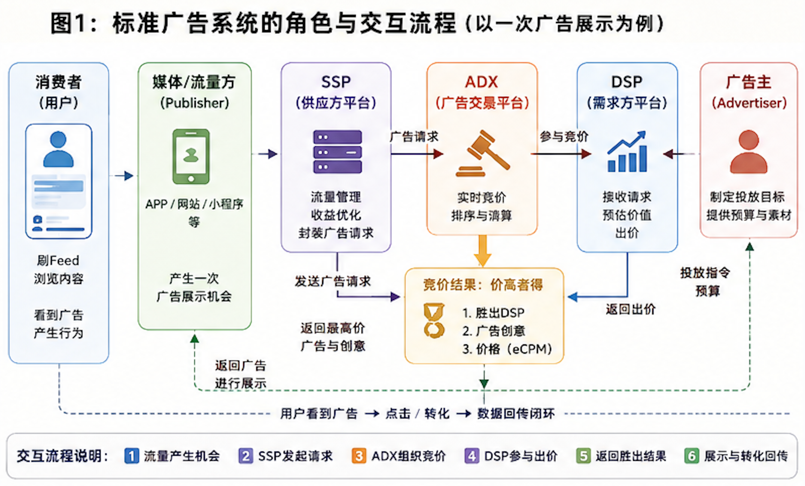
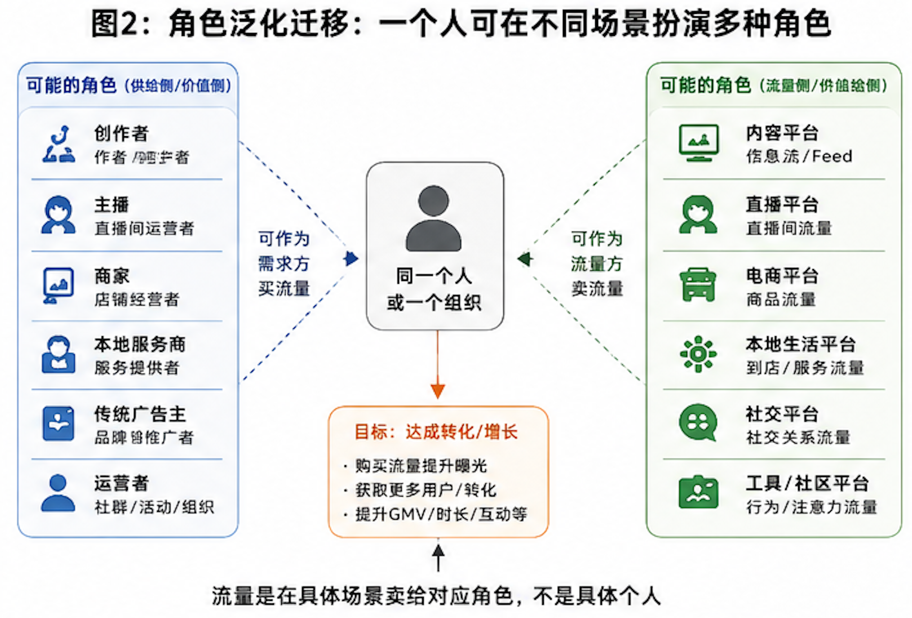
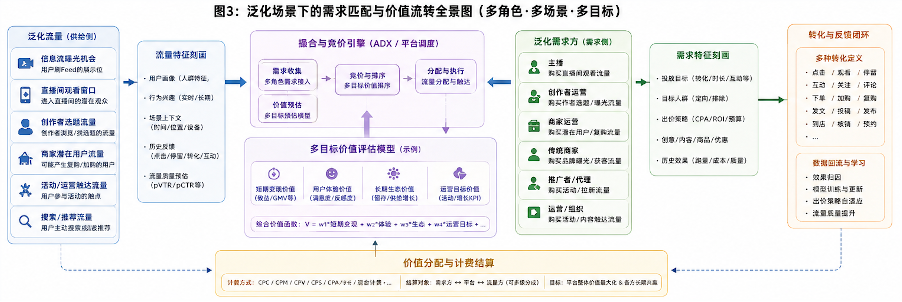

## 1. 前言

我最早接触广告是在百度，当时刚校招入职，做了两个事儿：DSP 系统、OCPC 数据回传，都是广告相关的，当时接触了大量的厂商，凤巢、抖音、广点通、神马、阿里妈妈等等。第一次感受到流量是怎么玩的、商业变现怎么玩的，这些内容对于应届生是友好地，做互联网，搜广推还是非常值得搞一搞的，对于业务理解、技术能力提升都是很有益的。

最近又在做“类广告系统”，所有“售卖流量做三方转化变现（价值）”的模式，广告模式都是适用的。今天要写的主要是两部分，其一偏广告系统的科普，其二是如何利用好广告思路，做好流量售卖/购买（转化）。

## 2. 先说广告系统

### 2.1 广告的简要发展史

最原始的广告就是吆喝和招牌（文字&符号），最初就基础的视觉、听觉利用，吸引注意力、保留记忆点作为手段完成推介。后来技术发展印刷术普及，广告的得到了实质性的发展，尤其报纸这种高密度信息载体的呈现，逐渐出现宣发、品牌等广告形态，早期解决的都是信息传播的问题。

再后来音视频出现，电影、电视、广播等媒介出现，流媒体逐步成型，信息密度/传播途径再次丰富，广告的目的从“让大家知道”，变成了“说服”，广告开始侧重于**说服技巧、心智建立**，这个阶段**创意**变的极度重要。

再后来PC互联网时代，门户网站、搜索引擎开始出现，当年的谷歌、百度、搜狐、新浪，大家应该还有一些印象。谷歌重新定义了广告，发明了**「搜索广告」**，当时信息密度可以以爆炸来形容，上个阶段的大水漫灌在互联网这个渠道中变得有点“失效”，覆盖难度开始变高、覆盖的ROI 变低。这个时期，**广告从“广而告之”到“应需而现”的质变，本质上在注意力和时长中做精准广告推荐**。

再后来一直到当下移动互联网时代，广告的本质还是本世纪初建立的这种模式。但是在AI 时代，广告可能又要发生变革了，大模型投毒初见端倪。

### 2.2 当下广告业务概述

拿当下的广告系统举例，系统中的角色有这么几个：**消费者（去消费Feed和广告的人）、媒体/流量方（拥有用户注意力的角色）、供应方平台SSP（为流量方提供收益管理、售卖工具）、广告售卖平台ADX（实时竞价的平台）、需求方平台DSP（投放平台）、广告主（买流量出广告的人）**

简单来说，当消费者去刷Feed时，流量方空出一个点位可以插入广告，SSP 把这个点位告知ADX，ADX 通知DSP进行竞价，DSP 基于用户特征完成出价后，价高者得，广告为此付出一笔广告支出、拿到一个有概率广告点击/展示/转化机会。

AI 画的凑合看

这是最原始的计算广告的形态，再后来，不同的细分角色被同一个角色充分扮演后，开始出现更多的模式，业界主流基本都是你配置个“转化/投放计划”就行。

### 2.3 广告业务不同视角下的价值

广告业务在均衡的状态下，是一个多赢的事儿，流量方拿到了广告费、广告主拿到了客户、消费者拿到了想要推荐。但是均衡状态往往是不符合各个角色的利益倾向的，每个角色都想自己的利益最大化，都有自己的顾虑点。在充分博弈之后，进入新的平衡，也就是大家当下所看到状态。

#### 2.3.1 广告主

广告主的核心首先是转化，其次是少花钱，而不是少花钱。给对的人出一个胜出概率高的价是关键，背后往往一套相对复杂的出价策略。简单来说就是，把广告给有潜在意向的人，并且大概率比竞争者出价高一点。

**出价逻辑**

DSP 要为每次展示机会估算期望收益，通常就是**预估点击率 (pCTR)** 和**预估转化率 (pCVR)**，目前业界常用的，做pCTR主要是Wide、Deep、DeepFM、DIN、DIEN、DCN这些；做pCVR 预测要更难一些，ESMM、多任务学习模型。通常也是这两个指标综合来用。

有了预期转化（无论点击、实际转化），然后就是出价环节，粗暴来看 pCTR × pCVR × 目标 CPA，就是预期的eCPM，也就是预期成本，但不是纯粹的乘法关系。而且为了让平均转化成本尽可能贴近目标出价，会使用类似 **PID 控制器**。系统会实时计算近期实际成本与目标成本的偏差，然后动态调整出价系数。上浮或者下调，实际成本高于目标 → 降低系数，压低出价，实际成本低于目标 → 提高系数，激进获取优质流量。

更多实际应用的过程，竞价建模成马尔可夫决策过程：状态是当前预算、市场行情等，动作是出价，奖励是转化或收入。通过强化学习，智能体可以学会最优出价策略，在预算约束下最大化长期收益。

一条广告进来大概是这么个流程：**频控/定向过滤 → pCTR/pCVR 预估 → 计算 eCPM → PID/RL 出价调整 → 预算平滑检查 → 最终出价并返回竞价结果**

站在工程视角，过来一个did（也带点基础特征），拉特征、做推理（调几个模型）、出价、拿反馈、同步记录出价现场、异步数据推送。

#### 2.3.2 SSP

SSP 是供应方平台，帮助流量提供方把每次广告展示机会，以最高价格、最快速度卖给最合适的买家，同时保证媒体对广告内容和用户体验的绝对控制权。

本质上是一个决策系统，决定广告出不出，把流量包装成一次拍卖机会，从adx 那儿交易来广告。

**算法层面**：SSP 会基于历史数据和实时信号，为每一次曝光预测一个最优底价。如果所有出价都低于此底价，宁可Passback，展示自己的宣传图或公益广告，也不贱卖流量，以维护长期价值。

如果是三方SSP厂商，SSP 的主要收入是佣金，从实际发生的广告收入中拿分成，跟流量方的利益程度基本是一致的，但是SSP 会比流量方更倾向于多卖。

但是目前巨头林立，ADX + SSP 往往是一体的，甚至ADX + SSP + DSP 都是一体的，也弱了其中的边界，就是个ad，只需要一个投放计划，本文只从标准结构来讲一下，除了相对黑盒外，直接对投放计划也是个省心省力但不咋省钱的好事儿。

#### 2.3.3 adx不单单是竞价

adx 是一个广告的实时竞价平台，它本质上是一个**高性能、低延迟、带流量分配和交易规则的实时拍卖引擎**。ADX 绝不只是一个传话筒或者中介。对媒体来说，终极目标是**让每次展示卖出最高的价钱**。因此 ADX 需要做动态底价管理、多级竞价通道设计，确保流量不被贱卖。

大概是一个这样的关系：

        DSPₐ (代表广告主A)                 DSPₑ (代表广告主B)
           /       \                        /        \
          /         \                      /          \
    ADX₁ (公开市场)   ADX₂ (垂直市场)    ADX₁ (公开市场)   ADX₃ (巨头自有)
          \         /                      \          /
           \       /                        \        /
        SSPₓ (大媒体)                     SSPᵧ (中小媒体联盟)

前面提到的ADX + SSP + DSP 一体模式，是一定程度可以避免自己抬价自己、多投放之间rebalance的。

## 3. 再聊借鉴意义

一个广告系统大概会有上面这样的划分，但是实际的角色一定不是单调的三方协同关系，流媒体（信息流）、广告主（投链接）。流媒体可能是“商品流”、“商家流”，广告主对应的可以是电商商家、可以是外卖商家、可以传统的广告主。这是业内实践中最常见的形态，阿里妈妈这些就是典型的例子。我们接下来要做的是，把这些思路更泛化一些。

### 3.1 角色的迁移泛化

一个人是可以有多重角色的，你听说过作者运营、商家运营、广告主运营，有没有可能他们是一个人。**“流量是在具体场景卖给的是对应角色，不是具体个人”**，围绕这个我们就可以做迁移泛化了。

一个人既然可以是商家、可以是广告主。**那他有没有可能是 一个创作者、一个主播、一个外卖店、一个本地服务商，甚至你所服务的运营或组织**，都是有可能的，那再考虑一个问题**“他有没有意愿买流量，帮助自己做转化”**，再考虑一个问题**“你手里有哪些流量，这些流量的用户具体是谁？”**

AI 画的凑合看

### 3.2 重新做需求定义和撮合

**当你拿到了“流量类型/用户”、“需求方/客户”，那为什么不用广告这套模式撮合一下呢。**

创作者买Feed消费流量、商家买消费者流量、主播买直播流量、传统商家买曝光机会、推广者买在线feed、运营买创作者注意力，这都是现成的思路。

这里的关键是：识别客户、识别用户，用户是资源、客户是价值，还是前面提到，在不同的场景下，一个人可以是用户、可以是客户。

### 3.3 泛化场景下的需求匹配模型

当角色完成泛化映射之后，接下来的问题就变成了：**用什么规则/模型去完成“泛化流量”和“泛化需求”之间的匹配。**

标准广告系统里，DSP 拿到一次曝光机会，需要预估 pCTR、pCVR，算出 eCPM，然后出价。到了泛化场景里，这些变量需要重新定义：

- **流量** 不再只是「用户刷到的一条 Feed」，而可以是：
  - 一个用户点进直播间预计产生的观看时长窗口；
  - 一个创作者在某个时间段内刷创作选题的流量；
  - 一个商家在某个时段，刷潜在的复购用户，用作触达投放；
- **转化** 不再只是「点击」或「下单」，而可以是：
  - 直播间多了一个在线观众/多了一次停留时长的延长；
  - 创作者完成了一次供给发文；
  - 刺激完成复购；
- **广告主** 不再只是「传统广告主」，而可以是：
  - 主播
  - 作者运营
  - 商家运营

有了这两个重新定义之后，泛化场景里的「竞价」就变成了一个**多目标价值匹配**的问题：流量方（平台/SSP）在判断，把这次流量给到谁，能产生对平台整体价值最大的结果，而这个价值，未必是金钱收益。

- 传统广告主：1 次点击 ≈ 1 单位短期收益；
- 主播：1 次观看 ≈ n 单位短期收益 + 生态时长上涨；
- 创作者运营：作者1次发文 ≈ 长期生态收益 + 短期运营目标价值；
- 商家运营：1 次加购 ≈ 长期GMV 贡献 + 短期运营目标价值；

这里就是整体的预估的建模要重新做，发文预测、触达执行预测、时长预测等复杂转化预测，要远比点击预测难的多，这个就具体场景具体分析吧，需要对应的业务经验。

### 3.4 博弈结构：从“三方博弈”到“多边网络”

要抓住多角色的价值关系，整体来看，是一个多维的商业变现结构，略微复杂，这里不展开了

同样的，计费、计算逻辑也会变得更复杂，而且目标往往是多维的，物料也不是互斥关系，会有成本上会有重合关系，当非互斥、重合时，ROI 只会更高。

这些操作在传统广告系统里无法实现，因为广告系统的价值函数太单一（只有变现效率）。而在泛化系统里，**价值函数是多维的**：GMV、时长、互动、供给丰富度、创作者留存、用户满意度……优化目标是一组指标的加权组合，而分配机制需要能够承载这种多维度的价值调度。

就先写这么多吧