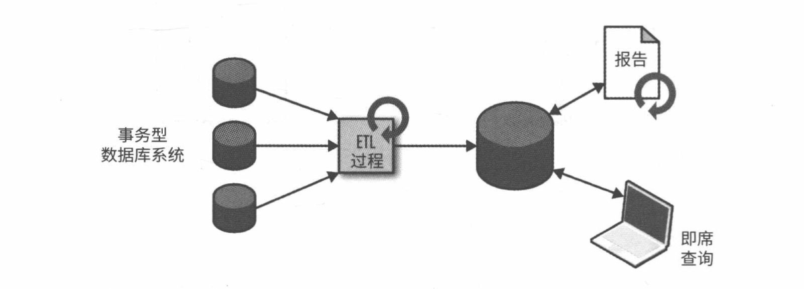
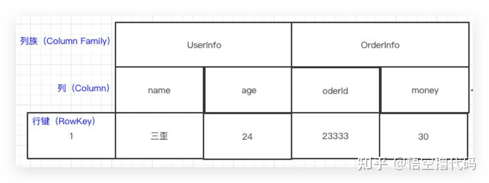
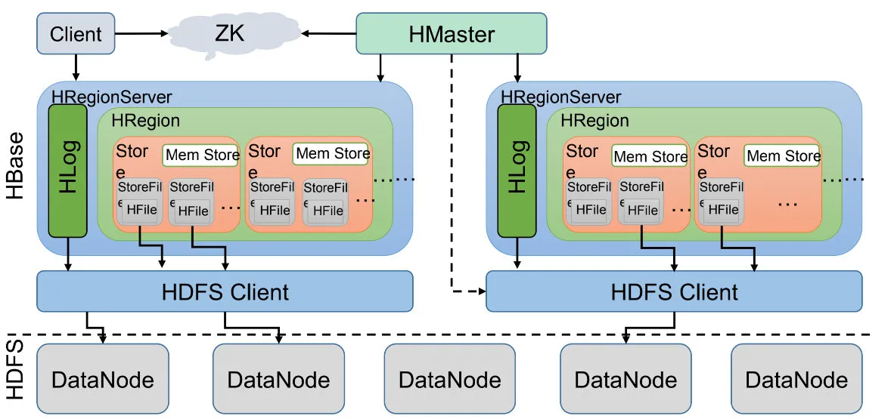
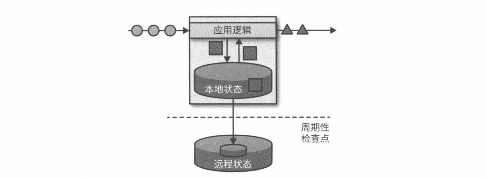
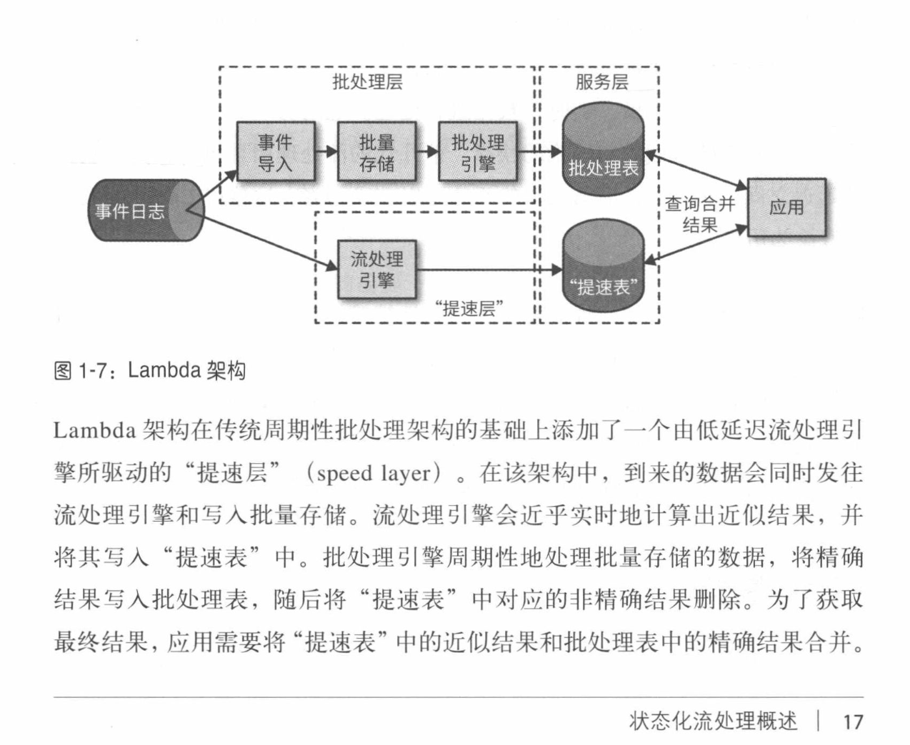

## 前言

* ### 大数据

大数据仿佛已经是一个过时的话题，不再像AIGC这些计算机领域新型的技术这般火热，但“过时”只是技术上热度的减退而已，更多扮演的是“巨人的肩膀”这样的角色。现在新兴的各种“高”“精”“尖”技术，无一例外都是在大数据的基础之上的，不信你可以看下为什么国家的规划开始吧大数据算力中心、数据中心的建设放到了首位。

数据的意义是很大的，越是海量的数据，其中埋藏的价值也就越高，挖掘的意义也就越大。要做的就是从海量数据中得出结论，拿到这些结论并且进行实践应用。我们可以从历史数据中获取经验，并作出应用，以不断变化的数据来修正策略。首先得能海量存储数据，其次要能快速作出计算，然后需要尽可能实时的处理增量，而这些就是经典的分析处理（AP）场景。

* ### 数据处理

计算机世界本质上是利用计算理论构成的系统进行数据的存储、传递、处理，网络那篇大致讲述了数据的传递，计算那篇讲述了数据的处理，从磁盘到分布式数据库那篇讲述了面向TP（事务处理）场景下的数据存储系统，这次就来看一下AP（分析处理）场景下的数据存储系统。

ps：我把这两部都认定为是数据存储，而不是数据计算（处理），是因为两部分都是侧重于数据的保存和目标信息的快速给出，其中当然会涉及到数据计算和处理的部分，但是侧重点是存储上对于数据的高效组织和边界使用。附属于系统之上的应用，比如基于Mysql的系统、基于OceanBase的系统、基于Flink的系统，基于MapReduce的系统，我认为是属于数据计算（处理）范畴。

## 聊聊数据处理发展

从传统的数据处理说起，

OLTP、OLAP，到HTAP、HSAP

前面讲过 存储和OLTP

接下来讲OLAP和

AP：ETL

常规的数据分析系统的搭建思路往往是从处理型系统中把数据提取出来，然后转换成统一用于分析的数据结构、编码等等，最后进行数据的加载放到专门用于分析的“库”中，进而提供数据分析的服务。整个提取-转换-加载的过程，就是我们常说的ETL机制。

当前分布式微服务架构之下，数据是十分零散的，而且很多数据是无结构的。各系统应用为了在各 自访问模式下都能达到最佳性能，通常会对自身使用的数据进行异构处理，比如搜索、关系型数据、Key-Value数据等等、文档结构等等，这些数据的存储可能是集中式的，也可能是分布式的。整个提取、转换、加载的过程非常的麻烦。

并且为了保证数据的完整性，我们需要一次次的执行这个过程来获取增量数据。

AP：分布式文件系统

说到文件系统，我们常规的反应都是单机上的文件系统，比如Linux VFS，单机的文件系统受制于硬件、文件系统的操作效率，通常会有上限存在。这个上限（单机瓶颈）面对海量数据时是远远不够的，那怎么办？老套路，做分布。
于是分布式文件系统就诞生，对于这个系统往往有高可用、高容错等可用性诉求，还有高吞吐等等，于是Hadoop Distributed File System就落地了。
跟我们做分布式系统的思路一样，通过网络把不同的数据块分散到不同节点之上，能对于这些节点进行名称管理，进而快速的索引和读写，多partition、多DataNode、多DataBase 背后都是这个思路，侧重点不同罢了。

类比一下：同之前的分布式数据库思路几乎是一致的，把数据按照一定规则做切分，能快速的找到目标节点，一个基于文件系统层面做分布，一个是在数据库应用层面做分布，然后节点之间针对某分片互备，不过HDFS更多的侧重于容错和存储扩展，分布式数据库更侧重于“活”，分片路由上HDFS更强调「CPU较为空闲」「磁盘存储空间较足」，显示存储路由信息，而分布式数据库更多是既定规则选择 + 少量路由信息存储。

这样就做到了用大量的廉价计算机来存储海量的数据，抛开瓶颈，比起使用大型机、小型机机器成本要低的多。

HDFS主要由客户端Client，主节点NameNode（名称节点），第二名称节点Secondary NameNode，数据节点DataNode，机架Rack几个组件组成。

HDFS主要由客户端Client，主节点NameNode（名称节点），第二名称节点Secondary NameNode，数据节点DataNode，机架Rack几个组件组成。如下图所示：

- NameNode主节点：负责管理文件系统的命名空间，元数据信息。可理解为图书管理员。
- Secondary第二名称节点：也叫辅助名称节点，提供主节点的备份，也可以处理一些操作，如定期合并和压缩NameNode主节点的编辑日志，减轻NameNode的负担，是NameNode的好助手。
- DataNode数据节点：负责存储文件的数据块，定期向NameNode主节点报告存储状态，可理解为书架的某个位置。
- Client：客户端：用户或应用程序，是数据读取和写入的发起者，可理解为借阅者。
- Rack机架：物理架构，主要存放多台物理机，每个DataNode也属于对应的物理机，可理解为图书馆的书架。

一次数据块的写入默认是三个DataNode，集群外是就近原则，集群内是随机选择，首先Client找到第一个dataNode，然后dataNode-1与dataNode-2建立pipline 进行写入，dataNode-2与dataNode-3建立pipline 进行写入，然后递归ack确认，最终返回Client 写入成功，写入后会把写入的位置信息写入NameNode，然后nameNode记录变更流水（edits），然后二级名称节点负责进行新元数据文件（fsimage）的生成。

数据访问时，选择就近的DataNode，进行数据读取并返回。

AP：分布式数据库HBase

HBase是一个在HDFS之上落地的基于RowKey的非关系型列族数据库。（如果粗暴点，就是一个有规律Key的Key-Value数据库）

### 分片

根据 RowKey 把数据切分到不同的 HRegion 上，一个 HRegionServer 可以有多个 HRegion。

### Store

一个 HRegion 里边有多个 Store，每个 Store 其实就是一个列族的数据，所以我们说 HBase 是基于列族存储的。

Store 里边有 Mem Store、Store File、HFile。

HBase 在写数据的时候，会先写到 Mem Store，当 MemStore 超过一定阈值，就会将内存中的数据刷写到硬盘上，形成 StoreFile，而 StoreFile 底层是以 HFile 的格式保存，HFile 是 HBase 中 KeyValue 数据的存储格式。

### HLog

我们写数据的时候是先写到内存的，为了防止机器宕机，内存的数据没刷到磁盘中就挂了。在写 Mem store 的时候还会写一份 HLog。这个 HLog 是顺序写到磁盘的，所以速度还是挺快的。

### HMaster

HMaster 会处理 HRegion 的分配或转移。如果我们 HRegion 的数据量太大的话，HMaster 会对拆分后的 Region重新分配 RegionServer。如果发现失效的 HRegion，也会将失效的 HRegion 分配到正常的 HRegionServer中。

AP：离线计算 - 分布式计算框架
	ETL、Hadoop MapReduce、Spark

### MapReduce

而MapReduce是一个分布式计算的框架，里面包含map、reduce两个核心函数，它负责在海量的分布式式存储的数据节点之上进行并行计算（map），进而聚集出最终的计算结果（reduce），通常，Map/Reduce框架和[分布式文件系统](https://svn.apache.org/repos/asf/hadoop/common/tags/release-0.18.3/docs/cn/hdfs_design.html)是运行在一组相同的节点上的，也就是说，计算节点和存储节点通常在一起。这种配置允许框架在那些已经存好数据的节点上高效地调度任务，这可以使整个集群的网络带宽被非常高效地利用。

AP：实时计算 - 状态化流处理
	流处理（Streaming）和批（batch）、无界和有界

​	聊聊DataFollow

在Dataflow模型提出以前，流处理常被认为是一种不可靠但低延迟的处理方式，需要配合类似于MapReduce的准确但高延迟的批处理框架才能得到一个可靠的结果，这就是著名的Lambda架

​	Spark Streaming

Flink

Apache Flink 会将应用状态存储在本地内存或嵌入式数据库中。由于采用的 是分布式架构，Flink 需要对本地状态予以保护，以避免因应用或机器故障 导致数据丢失。为了实现该特性，Flink 会定期将应用状态的一致性检查点 (c h e c k p o i n t ) 写 人 远 程 持 久 化 存 储 

数据处理架构：第二代互联网应用？事件驱动式架构？

事件驱动型应用 - 异步非阻塞式（事件日志通信，主动触达）：广告、推荐，消费端、生产端 并不在一起

BS/CS架构 - 同步阻塞式（请求+响应）：常规C端服务，请求响应强绑定

首先需要有一个更标准的应用来解决，高效归一化存储的问题，流式处理框架就是做这个事儿的，这就是第一大核心用途。

Lambda架构在传统周期性批处理架构的基础 上添加了一个由低延迟流处理引擎所驱动的 “ 提速层”，第一代开源流处理引擎通过牺牲 结果的准确度来换取低延迟。以 当时的眼光看待流处理系统，计算快速和结果准确二者不可兼得，因此才有了所 谓 的 L a m b d a 架构。

 在 该 架 构 中 ， 到 来 的 数 据 会 同 时 发 往 流处理引擎和写入批量存储。流处理引擎会近乎实时地计算出近似结果，并 将其写入“提速表” 中。批处理引擎周期性地处理批量存储的数据，将精确 结果 写入批处理表，随后将“ 提速表” 中对应的非精确结果删除。

事件总线

基于事件总线（自身是六边形架构、发布订阅（多了个管道）-观察者架构）落地的微服务的事件驱动式架构。

