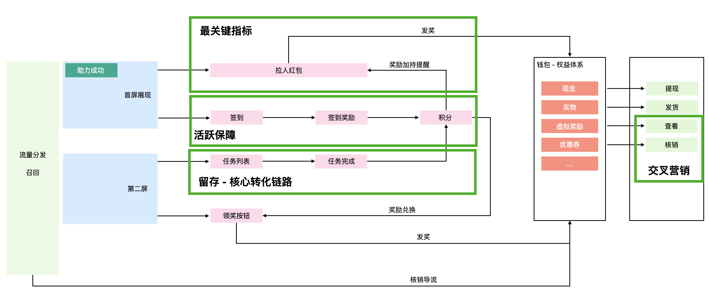
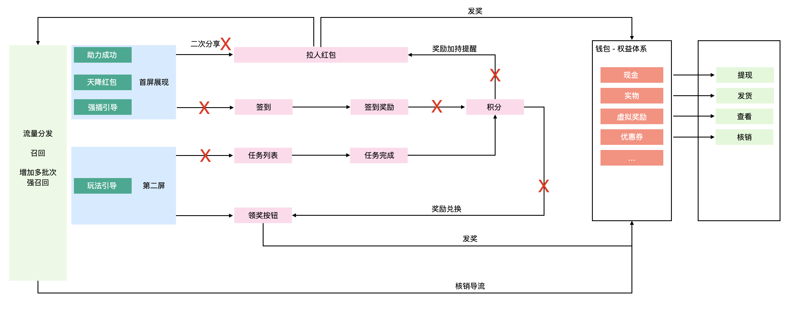
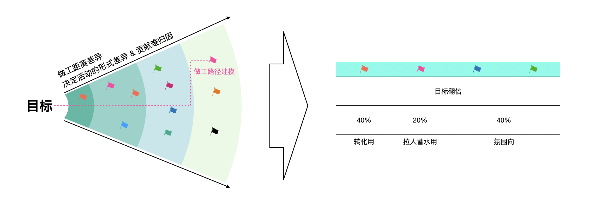

# 1.前言

之前工作两年左右的时候，自认为懂了，写了一篇流水帐似的《我认知中的营销活动》，工作四年，自认为已然大成，写了一篇《营销活动提效之道》，最近感觉到了一些瓶颈，没想到什么突破的好思路，所以决定回头看看，再谈一下这个话题，毕竟接近六年的时间几乎都给了这件事儿。

## 1.1 常见的营销活动

下面这个图所呈现的都是大家过年过节时所熟知的，甚至为了他们各大互联网公司开始造节。他们属于不同的业务场景，服务于不同的业务目标，来源于不同的公司，但是他们所呈现的形式都是一样的或者相似的，我们把他称之为活动。

这些活动由一些有趣的玩法组成，也可能是一些不太有趣的玩法，这些玩法通常是一组功能集合（由前端页面和交互、后端策略和数据构成），功能组成了一个相对独立的个体，我们能拿出来说的个体。比如做个任务、比如集五福。

这些年，应该就是从集五福开始，玩法透出的规则策略越来越复杂，尤其是网络购物时，优惠的计算逻辑已然难出天际，可能是为了少花钱骗用户下单，哦对，这不是骗，这是生意。当然，大家（也就是用户）也都学聪明了，开始有了对抗心智。

不管是为了让我发视频、还是去下单、又或者看广告、去聊天，他们都有着自己的目的，而最终目的就是为了挣钱，不是挣我的，就是通过我挣别人的。所以，它们开始铺天盖地的袭来，哪怕我和大家都很抗拒。就是在这个大背景下，跟大家聊聊营销活动。

## 1.2 能不能给营销活动下个定义

营销活动是什么？这个问题在工作第一年，团队就给了我一个答案和定义，过程中我对它也迭代了多次，现在长这样子：**“营销活动就是在一定规则和限制条件下，对产品不同生命周期的用户进行激励，从而达成阶段性目标”**。

这个观点支撑了我很长一段时间的工作。比如，来判断营销活动的合理性，判断这东西到底是不是营销活动，也帮我做了比较多的边界处理，甚至这个抽象定义帮我完成了整个系统的架构抽象和设计。

围绕这个定义，做了之前提到的整个活动工厂的设计，比如围绕激励、围绕限制规则、围绕阶段性目标。建设了在营销活动业务场景下的：「用户激励模型」「变化的控制和收敛体系：玩法策略规则剥离、玩法间编排、创新玩法生产」「活动效果洞察和反哺体系」。

一直到现在，我对于这个认知都是赞成的，不过这个定义已经不太能支撑我往前走了，只能帮我解决营销域内的问题：“如何做好一个营销活动”，想在营销域之上解答一些：“为什么需要营销活动”、“什么时候需要营销活动” 就有些吃力了，说句黑话，我在尝试迭代自己的认知。本篇想聊的想聊的点有三个：

* 聊聊擅长的“营销域内问题” - part 2，建议营销新手阅读
* 跳出营销域，聊一下想笑活动之于业务 - part 3，这部分的目的是讨论
* 未来的活动将何去何从 - part 4，纯属畅想未来

第一点以分享为主，第二点以探讨为主，第三个算是对未来的展望了，欢迎大家多多的给予一些指导。另外，这篇文章不算是一篇技术文章。

# 2.营销活动域内的那些事儿

**“营销活动就是在一定规则和限制条件下，对产品不同生命周期的用户进行激励，从而达成阶段性目标”**

用到营销活动的场景有很多，大家也喜欢用，也就是这个原因导致营销活动的需求量**“多”**；

很多时候营销活动往往扮演一个救火的角色，最后不知道怎么办的时候，就做个活动，导致营销活动很多时候还很**“急”**；

营销活动本身就是一个**“易变”**的场景，尤其是竞争白热化之后，最重要的可能是**“创新”**；

活动的诞生，说白了就是为了更好的“花钱买量”进而“赚钱”，总结一下就是**“更少的钱买更多的量”**。

这些是台面上的难题，我们要解决的话，需要向下挖，围绕营销活动的定义，找到我们能做功的地方，也就是转化为技术可求解的问题。

## 2.1 定义问题 - 找到技术可做功的点：效率问题

“应对多”、“应对急”、“应对变化”、“保持创新”、“更少的钱买更多的量” 本质上都是效率问题，效率大家都熟，但是提到提效，可能又会皱皱眉头。提效是一个比较烦的事儿，可能因为聊烂了，也可能是因为没有思路。

提效是有方法论的：“找到效率的描述对象，找到它的工作路径，找到重复/多余/大工作量/长路径/位置不合理的地方，优化掉它就好了”

“多”、“急” 通常是**“人的效率”**，“创新”本质上是“变化试错的效率问题”，只不过是主动求变的场景下**“人的效率”**，“更少的钱买更多的量”也就是**“钱的效率”**

直接给一下整体的解决方案，这几个问题的解决方法有很多种，这是业内相对认可、共识的一种方案，后面来讲这几部分应该如何落地。

## 2.2 缩减边界成本：人效问题

我们的目标是降低生产活动的成本，更准确的是**“缩减下一个活动的成本”**，本质上就是边际成本的减少，而边际成本缩减，一定是通过构建基础支持设施，实现构件标准化、流程自动化，从而工厂化，以此压低边际成本。

**大部分战术动作的经验是可以复制的**，营销活动提效，可以通过**复用**减少“重复”、“冗余”的工作步骤，通过某些技术手段缩短“大工作量”、“长路经”的地方，复用+某些技术手段 就是我们要构建的基础设施，构建完之后的整个系统，就是我们的工厂。

### 2.2.1 关于复用，建议领域驱动设计：“以抽象的方式，概括过去和现在，尝试预测未来”

营销活动重复工作非常明显，比如说每个活动都有抽奖、拉人、任务。但是复用并不能直接把这些代码留存下来，而是通过一定的加工工作，把他们变成模具，把系统变成一个标准件厂。

归结一下大类玩法就那么多，奖励、裂变、任务、答题、打投…只不过每个活动中的玩法可能有些变形罢了。所以，泛奖励、泛裂变、泛打投等等就这样诞生了。

比如以泛奖励为例：

一个正常水平的架构师，适当做一些设计上的取舍，抽象一个模型来支持过去所有需求，甚至预判未来的大部分需求，并不是什么难事儿。

有几个可以分享的观点，领域设计的颗粒度问题、边界问题非常的重要，这些可能决定了模型的合理性，这直接决定了领域设计是不是真的能起到作用，如果没想清楚，盲目的使用所谓的领域驱动设计，只会适得其反。多问自己几次“这到底是个啥”一般就解了。

在营销活动域内，这些基于领域设计的模型，会直接决定了你设计的模型能不能像想象中那样工作，能不能真的解决复用问题，营销活动中的建模维度通常有这么几个：活动、玩法、能力，活动泛化为目标模版、玩法泛化为基础模型、能力则具象化为功能函数。

关键词：领域驱动设计、面向对象设计、泛化设计、六边形架构、复用颗粒度、复用机会分析

### 2.2.2 关于技术提效，鼓励技术试错和技术迁移：“不断尝试以不同的技术、不同的姿势去解决问题”

对于营销活动域下的开发工作，总是会充斥着大量且易变的东西，既然阻止不了变化，那就让这些大量且易变的工作，变简单，变起来成本极低。

#### 比如业务功能上

首先识别哪里会变：活动自身的玩法种类（这个上面已经解决了）、活动的页面UI&物料、活动内的玩法组合关系、活动内玩法内的规则策略

翻翻自己的武器库：规则引擎&自定义scheme之上的 “低码”&“无码”

#### 比如技术实践上

首先识别哪里会变：多变的部署关系、负载的流量策略&部署策略

翻翻自己的武器库：ServerLess、流量染色&隔离

关键词：事件驱动设计、低码、无码、ServerLess、FAAS、总线驱动机制、发布&订阅、规则&决策引擎、边车代理

## 2.3 角速度与线速度：钱效问题

当我们的人效问题优化到一定程度之后，想提效其实就很难了，除非又有什么新的、突破性的技术出现。

人效和钱效（狭义）的关系，很像是角速度和线速度的关系，如果扫过的面积就是活动的做工面积，那么角速度就是我们的人效，线速度就是我们的钱效，我们优化钱效得到的效果甚至可能是指数增加的。

钱效的优化是：由点到线，再到面的过程。

### 2.3.1 钱效的一种思路：权益效率提升

首先是点的优化，把钱用到刀刃上，用户并不千篇一律的，尽可能增多权益的定价策略，减少恒定价值权益，关注用户想要什么，有的用户你就算给100块也撬动不了，完全超出了拉新回的成本，有的用户5毛钱就足够了。

权益体系设计的好，5毛钱能花出100块的效果，所以就像前面提到的，我们必须进行权益效率分析体系的建设，至少要反映出用户对于权益资金价值之外的特征表现，比如情绪、表达、敏感程度。

对于表现形式主要考虑的是用户疲劳程度及价值透出度
对于权益领取来说，主要考虑领取门槛及门槛难度，这里的难度主要是玩法操作难度、用户社交压力、用户操作成本。
对于权益核销而言，主要是考虑易用性、核销限制。

### 2.3.2 钱效的一种思路：运行视图的呈现

接下来由点到线，聊聊信息流、资金流。

活动中的钱主要以“流量”、“权益”的形式存在，当我们落地一个活动的时候，「活动交互热力呈现」、「参与信息流视图」、「资金链路」就存在了，要做的就是围绕这几个视图为起点，首先洞悉整个的活动运行情况，第二洞察整个活动的问题所在，第三产生优化计划和实验，最后落地优化实验。

所以我们至少要保证，我们产出的活动是可观测的、全规则化的，其次要具备对于活动数据的呈现能力，然后不管人工也好、模型也罢要有优化计划的产出和执行能力。

比如这是一个用户对于活动的「参与信息流视图」，我们可以围绕这个信息流做活动策略的优化、活动玩法的优化、活动漏洞的优化。

比如这是一个活动的「资金流视图」，我们可以围绕这个资金流，减少资金占用、避免资金空转、减少无用核销等

ps：不仅活动要差异化投放、规则更要差异化

关键词：资金流优化、信息流优化、业务策略规则化、优化计划、千人千面

### 2.3.3 技术可以做功的点：时效&时变

前面提到的是钱效优化最基础的思路，这个全行业内都是这样做的，这会儿就体现出了技术的重要性。

这里主要是从工程的角度出发，我们围绕活动的运行视图去产出优化计划并执行的过程，会有一个时效性的问题，尤其是纠偏的时效性。如果时效性相对较低，我们的活动呈现是静态的，但是随着活动优化的时效性提升，比如说天级别、小时级、分钟级、秒级优化动作，活动一直在变化，慢慢就变成了真的具有“交互性质”的活动了。一个用户参与着活动，参与着、参与着，这个活动变成他自己的活动了。

初期，背后的技术方案并不复杂，需要围绕前面提到的钱效，搭建一个相对理性的指标体系，构建一个实时的数据链路，然后不断优化，让增量的实时数据和阶段性的离线数据组装一下，就出来了。

比如上述的活动，我们以分钟级动态的呈现活动的实时漏斗状态，及不同时间之下活动的运营视图变化情况。

但是要想做到理想的那样，还是有差距的，不过写下去，还是可以的。这也是我一直非常相信的营销活动未来最清晰的发展道路。不过石器时代的未来，一定不是超级石器时代。现在局限性还是太强了，所以决定让自己跳出来看看路，不钻牛角尖。

关键词：数据实时化、Flink、自优化、机会点挖掘

### 2.3.4 钱效的点线“面”

这个我认为单就营销活动聊是不合适的，所以放在了part 3，往后读你会看到对应的内容的。

## 2.4 单独聊创新

营销活动是一个很讲创新的场景，需要不断的创新来缓解用户的疲惫感，才能更自然的耍流氓。创新不难，能够创新成功很难，一次创新成功带来的效果，可能要比我们前面说的那一堆节省出来的成本还要多。

虽说创新的成功具有偶然性，但是如果你的试错成本足够低，那基本就是必然。而试错成本，这个成本其实就是前面提到的人效、钱效，这些最基础的东西是保障创新的关键，所以别再吐槽公司做一些没有用的基础建设了，是在为更快的试错做准备，可以想想“APP工厂”背后的基建是什么样子。

而且作为一个工程师，个人认为以技术的手段去解决效率的问题，比人海战术给我的满足感要多的多的多。

对于创新的设施如下，搭建可以参考我的另一篇博客：《就创新试错，聊聊ServerLess的FAAS引擎实践》

# 3.跳出营销活动域

接下来看下，如何跳出营销活动域去看营销活动。前面提到的所有几乎都是默认营销活动是必须存在的，并且我们要友好的支持这些“必须存在”的营销活动的前提下，建设了用于提效的营销活动工厂。在既定的条件下，降成本、扩受益，搞定ROI。

但活动真的有必要存在吗？最近问了自己几个问题，来质疑一下自己工作的意义：

​	活动的存在意义 - 现在做的活动真的有必要吗，把活动全砍了会有影响吗？

​	活动的供需关系 - 哪怕数据效果正向，活动带来的影响真的是正向的吗？花钱买量是不是有效的？

​	活动的生产关系 - 活动一定得是平台产出活动，服务用户？会不会是B2B2C？会不会是C2C？

​	未来的活动以什么形式存在？

## 3.1 活动的存在意义：真的需要营销活动吗？

首先，我认为是真的需要的，其次事实上存在即合理，再往下挖一层，看看营销活动到底是什么，个人观点：营销活动始终是一款产品中的旁路功能，但它必不可少。

### 3.1.1 营销活动是什么？

用户视角：营销活动更像是在用户整个生命周期扮演酒精的角色，让用户冲动一把，让用户放肆一把。除非整个产品本身能持续、源源不断的给予用户兴奋感，又或者用户对它有强粘性，否则营销活动一定是必然需要存在的。

公司视角：如果把一个公司的生态比做一个池子，营销活动就是这个翻起浪花的飓风，是往池子里注水的水泵。

比如说：

增长阶段，活动给予那些犹豫不决用户进来试试的态度，给予那些抗拒用户试一试的态度。

留存阶段，活动给予那些冷静期的用户二场的体验。

业务转化阶段，让用户不定期的兴奋一下，比如冲动消费一下、无顾忌的袒露下心声、由活动搞一下情怀。

### 3.1.2 有的放矢：不同业务形态中适合的活动形式

营销活动的存在几乎是必然的，但是我认为仅仅是符合业务形态的营销活动才是必然存在的，那种适合每种业务形态的普适类活动，存在的必要性就需要打个问号了。未来营销活动的发展一定是融入业务的，符合业务生态的活动才是必然，活动和业务的结合程度，直接决定了活动的影响力。

业内的营销活动，有种**“降调的趋势”**，本质**并非降调**，是融入整个业务，变得更自然了，看起来降调了而已，未来营销活动系统的发展，也一定是有**足够好用**工具供各个业务快速支持适合自己的活动，从业务中会抽象而出，产生好用的工具后，又回归业务。

电商、大文娱内容类、社交、本地生活、金融类（支付/信贷/理财）各大业务域内的活动形态都是不一样的。

比如电商最重要的就是GMV，一切的行为的最终目的都是让用户下单，活动服务于让用户下单/复购的每个生命周期，活动不易过于复杂，需要打直球，适当的玩法形式把激励给到用户就够了。一定要把 **“我做这个事儿是为了获得优惠”**这个心智给用户建立好，才是电商活动主要抓手。而且电商域的活动更注重“权益效率”，，权益之上千人千面的激励策略是必须的，场景-店铺-用户-用户行为更细粒度给到用户激励，让用户感受到收益。

比如大文娱类的活动，用户本质上就是来玩的，玩的是活动本身，主打的是氛围，而不是那一两块钱。活动形式可以丰富起来的，重点是参与感、活动感受。体育赛事、明星、重大节假日都是这一类活动，让用户在活动中具有获得感就够了，这个获得感的表现可以是“参与感”、“认同感”、“怀旧”、“喜上加戏”等等任何表现，权益的表现更多是周边类、认证类，哪怕是一个带个人信息的tifo认证都是可以的，玩法的表现更多的是相对复杂的游戏类，挑战类。谁也不会拒绝在自己死忠的球队赢了之后，完成一次漂亮的分享。

比如本地生活，衣食住行是用户的常态，小商小贩才是本地生活的本质，用户不需要造节、用户更不需要尊贵的外卖认证，用户更关注的是“长期主义”，首先本地生活的单笔消费往往不会很高，但是持续性非常强，用户需要的是源源不断的肉眼可见的优惠，比电商的要求更高，活动需要更轻，小时侯消费几次之后就主动帮我折扣一下，消费几次就有概率获得一些奖励就是不错的特点。其次是新鲜感，让用户感受一下不一样，可能是本地生活的一个新赛道“聚会新玩法”、“换个口味”、“全城打卡”、“种草” 等内容池类也是不错的，这部分的活动是长期用来花钱的。

比如说社交，社交是一个极其需要用户体量、用户粘性的场景，活动在其中的存在感越低越好，但只是存在感低，这里的活动需要完全融入整个业务场景。社交的核心问题：大家都不用，我为啥用？冷启的用户群体异常重要，找到那群社牛是关键，然后从这群社牛启动撬动整个群体。比如说：

* 挖社牛群体：刷视频赚钱玩烂了？要不要试试聊天热度发钱，载体可以试试社交宠物？目前这个场景下，想要做社交是需要一些不一样的体验的，聊天过程中的游戏、社交宠物都是一些切入点。
* 做单点撬动：小圈子的活动，社交网络是需要一些围绕“交集”出发的活动，地区、校友、爱好、服务群、就诊群都是切入点。小圈子多了，重合点就多了，这时候做功的点就出来了。

## 3.2 活动的供需关系：活动带来的影响真的是正向的吗？

这里我是要打问号的，就我目前的观察来看，业内至少有50%的活动是没必要存在的，这50%中一些是因为有它没它都行，有的是产生负向作用的。（可能判断有误哈）

### 3.2.1 打扰 or 惊喜

最近618开始了，我是比较惧怕这种节日的，我老婆就开始准备大肆清空一下购物车，然后背后优惠的计算，完全不亚于让我去做一个复杂系统的设计。调研、竟对分析、方案定义、方案执行，甚至还要痛苦。平时买个东西，打开个app 这些活动总是会给我各种各样的打扰。

我的用户画像可能是不会计较这些优惠，但是力度很大又会感兴趣；我老婆，是热衷于这些优惠的。那为什么我俩看到的是一样的，为什么我没有找到一个直接的优惠来下单，为什么不给我老婆一份精打细算之后确实发生的优惠。

很多时候营销活动是一把双刃剑，对它感冒的人就是惊喜，对它无感的人就是打扰，但是该惊喜的时候变成打扰就不妙了。

### 3.2.2 做工距离的问题，建立活动的有效做工模型

这就是营销活动钱效上，面的问题，活动离最终目标的距离是会影响活动的存在形式的，而且距离目标越远对于目标的做工路径就越不清晰，我们评价活动的时候，通常是用一个“阶段性目标”来衡量的，这是不够置信的，比如拉一堆羊毛党的拉新活动，真的对于GMV真的有帮助吗？

因为哪怕阶段目标/数据效果是正向的，但是活动对于生态带来的影响可能是非正向的，比如伤害用户体验，伤害用户心智。如果需要活动来打造浪花，也要给用户一种惯性的感知。

我们应该建立活动对于用户全生命周期的归因能力，逐渐把每个阶段对于目标的做工路径给挖出来。比如电商场景，拉新阶段的活动，对于最终GMV的帮助有多少？把做工距离不同的活动放在一起比较，是不公平的。要有一个围绕目标服务的，有着清晰路径的活动的布局，只有这样我们才能知道活动到底是不是正向的。

图示为简单的建模释义，背后的归因模型要复杂的多，但是让路径从模糊到清晰，就是逐渐还原营销活动业务本身的过程。模型建立之后，就可以回答不同的阶段需要什么形式的活动，每个阶段的活动做到什么程度就够了，以此来达到一种动态平衡，以此构成整体生态的良性循环。

我们需要在这个模型上建立ROI机制才是合理的。

## 3.3 活动的生产关系

自组织的活动，用户在用户想要的时候，促成一场活动才是恰当的时机，比如电商场景，活动扮演的可能是一种“用户、商家、平台的砍价载体”

生命周期中扮演的角色（用户-产品：增长、留存、促活、转化），不同业务域中的活动

而且营销活动这个事儿并不仅仅只属于互联网。

