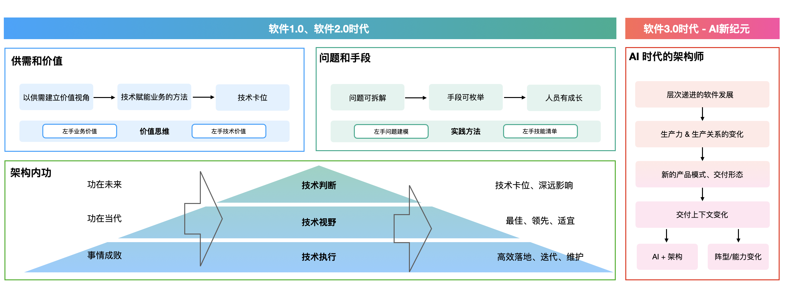
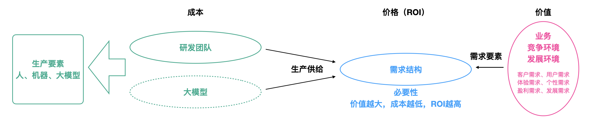
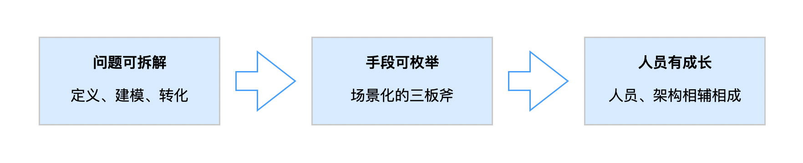
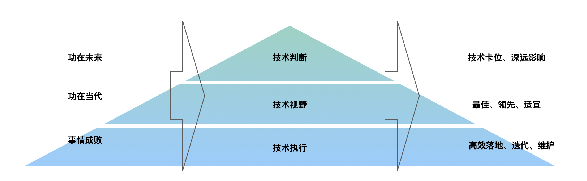
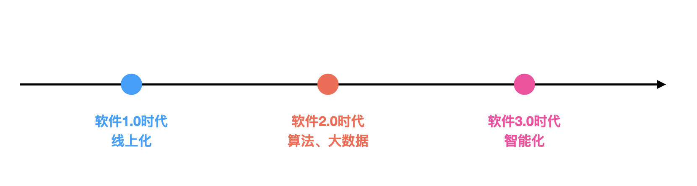
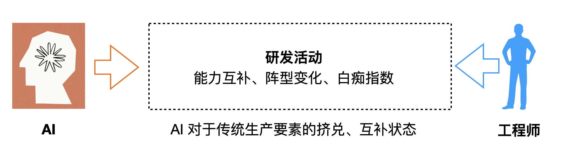

## 1. 架构师、架构、我的架构经历

工作满七年，好久没动笔，手痒整一篇。

重新再聊“架构”这个话题，四年前写过一篇《如何有效的进行架构设计？》，本篇打算从“有效”到“做好”，以架构师如何“做好”架构出发，务虚的方式来务实。

* **架构师**

架构，在工科相关的工作内容里都有所体现，比如软件研发中的技术架构、产品架构，建筑领域、机械领域等等也都有大量的相似工作和工种。架构还是工程师们，用于吹牛逼的利器，“要是我来做这个系统，XXXXXXX”

架构师是一个相对软性的职能，或者说兼职技能，除了专职的架构师，一线的开发同学需要具备架构能力，管理者（更准确是Team Leader）也应该具备，但凡负责「架构+开发/管理/等等」工作内容的，都可以被看作是架构师。

* **架构工作**

架构工作就是让系统建设变得有迹可循、有主有次、满足当下、适应未来的工作。架构是人才&时间&资源极度压力下，环境处于长期不确定的工作。也是一个经常要在打嘴炮、深度思考来回切换的工作。

软件架构的初步产物是一张蓝图（建设说明书），中期产物就是系统本身，中后期的产物是系统的更迭指导，哪些可为、哪些不可为、在什么时机应该以什么姿势做事儿，以此满足架构“可扩展”、“易理解”、“高性能”、“高稳定”、“低风险”、“低成本”、“安全性”等等一系列的架构考核和描述。就是这些东西延伸出一堆，比如：面向对象原则、AKF等实践方法；SOA架构、微服务架构等架构理论；领域驱动、风险驱动、质量驱动等指导方法，太虚不聊这些。

架构工作，除了对于软件本身的向内的建设，还应该包括：人的架构适用性（人性&组织）、业务的架构适用性（业务趋势&未来）、架构成长性（技术环境的成长）。**技术不是自嗨和炫技**，我们不可能满足所有的架构要求，也不应该满足所有的架构要求，适宜的才是好的，适应的对象就是“人性”、“业务趋势”、“技术环境”。尤其在国内几乎90%都是业务研发的状态下，人性&组织、业务趋势&未来与架构会成为决定架构成败的关键因素。

聊架构的场子，很多时候是一种合理吵架的场子，架构理论就是吵架的依据。

* **我的架构经历**

一直在折腾自己，经历过的软件系统比较杂，现在在做B/M端相关的运营平台；之前做过很长一段时间活动工厂（低代码之上的活动生产，独立的活动、玩法、权益体系），经历过好多年的春节巨型活动，像是央视春晚也都参与过；也搞过支付（当时的支付宝余额），做过资金效率；刚毕业的时候，在百度还做了一段时间广告相关的DSP系统，也给广告数据传输啥的打过杂；之前实习的时候还搞过交易，当时还恰逢下单流程重构。

这些经历让自己天然的对架构感知更强烈，而且职业生涯初期就有意识的建立架构思维，骂过很多系统，也见过成功的案例，自己操刀了大大小小模块、平台，有不少值得吹牛逼的作品，也有很多想重来一遍的工作。

本文主要内容有：「架构的供需和价值」「架构的问题和手段」「架构内功：执行、视野、判断」「AI 时代的架构」。

## 2. 架构的供需和价值

价值来源于需求，价格来源于供需，市场上一切皆是如此，架构也是同样的。要做架构，首先要建立的是**“供需视角”**，架构是生产端的活动，首先要回答的是为什么需要？需求的程度？的问题，这个问题是方方面面的，还有在满足需求之后，除了被动的满足对于架构的诉求，架构还要主动的贡献业务价值、组织价值。下面我们细聊。

### 2.1 环境对于架构的诉求和要求

不同的业务环境、不同的发展阶段、不同的人员素质对于软件系统的诉求都是不同的，这些诉求是环境对于架构的第一性需求。就是核心的北极星目标，还有预期伴生的约束指标。比如一些“完成比完美更重要” 的论调就是在某些特殊情境下发生的合理呈现。

比如运营平台，需求量极大、个性化要求极多、M端对体验要求极高、B端对于运营同学是干活儿的效率工具，极度灵活下的扩展性和适中的性能体验是建设的指导；

比如业内现在的支付平台，一分不能错，支付要快，需求量还好，稳定性（可用和数据一致）为王、性能要求屈居第二；

比如建设初期的活动平台，创新诉求、需求量大且多样、对C体验高，分级的扩展性（for 巨型创新的、for 常规简单的、for 例行微变的）是平台的长期目标，架构对于体验的保障（比如前后交互中的主动推送、平响性能）是中期的关键，活动平台的实时数据链路、洞察分析建设可能是后期的重心；

组织的人员构成和架构是互有诉求的，站在当前组织视角，要看清当前的人员构成，让团队不同能力的同学都能在架构不同的位置发光发热才是好的，或者说架构能大幅度的降低高阶人才诉求，降低团队成本也是好的。小部分场景阵型要随架构变化，比如支付场景，天然的对于老师傅的诉求就是高。

**架构的产物应该是符合人性的**，架构成败的关键很多时候就是人性的因素，符合操作/写码习惯、符合各方利益、符合惰性，越是符合人的“劣根性”越是容易成功的架构。

### 2.2 创造需求和价值：技术赋能业务

对于2.1 做一下延展 -- 技术赋能业务。这是技术同学频频听到的要求，尤其是老板对你发生更高的要求时反复提及的一个观点。技术赋能业务，本质上是在架构满足环境的诉求之上，以技术工作，推进业务的发展、引起业务变革的工作，这个过程是以架构视角发起的。

很多时候技术不熟悉业务、业务不熟悉技术，事情在以需求的方式，职能间协同落地，这种方式很多时候并不是很有效，有弯路可太正常了。

还有一种更佳的方式，简单来说：**“和业务保持站位一致，以技术视角给业务建模，找到其中技术可做功的点，完成背后的系统建设/优化”**，比如转化链路背后的交互形式、性能的优化；活动效果背后的秒数/分钟级数据洞察和调参，运营平台业务决策背后的AI分析提效又提质，资金效率背后的信息流&资金的时空分析等等等等，这些都是技术赋能业务。

把自己当成客户去了解下业务、把自己当成用户去体验下自己的产品，**多以经营视角、用户视角、甚至合伙人、投资人的视角看问题**，围绕自己的技术广度，很容易就发现了可做功的点，甚至因为你的技术创新，发生变革都是有可能的，如果还不清楚怎么做或者没有体感，翻一翻公司的颁奖记录，看看各个技术项目，是为什么拿的奖就清晰了。

PS：**职能思维是阻碍自己成长的最大因素**，拿掉“我是一个后端”、“我是一个测试”、“我又不是产品”、“我又不是业务”这类思维模式，反而可以更快的切入到技术赋能业务当中去。

### 2.3 可量化的供需：什么是好的？什么是恰到好处？

首先把环境对于架构要求（体验、稳定性、需求量、交付周期等等）进行收集，然后进行建模转化为一系列的技术指标，你会得到扩展性、性能、数据一致性、故障恢复时间等等一堆指标，这些看似模糊的词儿都是可量化的，建立起一个评价体系，比如平响时间10s、1s、100ms、2ms。

然后定义什么是好的？什么是恰到好处？什么是未来的要求？用户/客户需要多少，就是就是技术做好的标准。把握好这个度很重要，很多时候甚至系统够用了，供大于需，可能会被夸，但是“工作的价格”就相对廉价，追求成本 + 指标的平衡才是真的追求极致。当下不用建设到未来的预期，但给未来打出1～2年的技术提前量就好，比如说性能等指标，需要的时候很轻松就能优化到就行。

### 2.3 技术卡位：看得懂追不上、追得上来不及

我们处在一个竞争环境当中，业务开发场景下，**技术是没有门槛的，但是技术工作是有成本的。**

这是之前听一位老板分享时学到的观点，“技术工作、尤其是架构工作做到什么程度是好的？技术之于业务有不及业务诉求、满足业务诉求、技术给业务卡位三种状态，**最好的状态是技术卡位状态，让竞争对手，看得懂追不上、追得上来不及**”。技术工作的成本就能打出这样的卡位效果，竞争对手了看懂要做了，我们已经做完了，哪怕对方很快追上，我们已经建立好用户心智了。

## 3. 架构的问题和手段

架构工作面对的问题，按照具像化程度分，大概分为模糊问题和明确问题，系统的规模越大问题越模糊，很多时候到手的仅仅只有一个命题，比如成本下降、比如体验变好，甚至“把你负责的系统”整好一点。但是换个视角，问题越模糊，架构的意义的越大，对架构工作的诉求就越强，是个好事儿。**先低分辨率看问题、定义清楚后再高分辨率解问题，会变得无比简单。**

就记住一句话：**问题可拆解，手段可枚举，人员有成长**

### 3.1 问题可拆解

对于模糊问题的求解，通常会经过 **定义、建模、转化** 三个阶段：

首先要定义清楚“事实问题”是什么（要讲事实、讲现象、说变化和差异，**问题的本质就是与预期的差异**），在由模糊定义为可量化的明确定义（即使这个问题很庞大），比如说粗暴的把体验变好 -> 变成客户满意度，这样也比一个体验变好强。

其次，围绕一些拆解原则，把构成庞大问题给解构，站在架构视角应该叫做问题的建模工作。

比如客户满意度的核心组成模块，由交互形态、平均响应时间、反馈途径等构成，比如平均响应时间又可以往下继续拆，结构出来关键的组成部分。每个组成部分的优化工作又可以根据体验的多层次模型（比如最简单的可用、有用、好用）重新建模，构成影响体验的问题模型，最后将诉求转化为具体的技术指标，让其可被评价，**这些拆解又建模的过程就是白盒化的过程**。

### 3.2 手段可枚举

面对问题，大多数业务研发同学，尤其3～5年变成超级熟手的时候，通常会发现“技术也就那样”，就这么些招式。事实确实是这样的，只要经验足够丰富，在你的领域里“招就是这么几个”，三板斧异常有效，新人顶多就是这几招的熟悉过程、或者多踩几次坑的过程。但是也别小瞧，事实上知道什么场景，三板斧该出哪一板已经很了不起了。

既然事实如此，如果你是架构师，那就建立一个问题技能清单，打个表，让大家需要的时候查一下就行。比如：

画出逻辑架构，指出想保障扩展性，通常有哪几种方法，什么时候用规则引擎分离变化、什么时候用总线解模块依赖、什么时候上策略模式、领域到底怎么划；

画出运行视图，性能优化可以怎么做，什么时候剪短IO链路、什么时候异步、什么时候批量处置、什么时候合理并发、什么时候缓存；

画出信息流图，数据一致性现状是什么样子，如果适度舍弃一致性该怎么舍，想加强一致性，又可以有哪些手段；

画出资金流图，资金流现状是什么样子，哪里链路长，哪里链路短，要剪链路，应该基于什么的原则，热点账户、热Key等典型的处置手段；

画出存储架构，什么情况选什么样的存储，切换存储的时候怎么切换没问题；

类似的场景还有很多，问题建模完成之后，对着手册找技能就行，让架构工作变成傻瓜式，是最理想的状态，而事实上，大部分公司这方面做的其实都差点意思，历史包袱口口相传、线上问题靠踩坑发现 才是现在业内的常态。如果团队搞不成，可以给自己建立一套这样的问题技能清单。

PS：手段不分高低贵贱，一把梭，也是很实用的、典型的架构形态。切记：技术不是自嗨和炫技。

### 3.3 人员有成长

一个好的架构迭代/演进过程是能带着团队和组织成长的，不同能力象限&程度的人/团队负责不同规模的问题、做不同程度的架构设计。尽可能让团队成员手上的工作拥有一点挑战，但是这个挑战不要太大，是最适宜的状态，避免团队处于滞涨状态，更长期就是士气低落且散漫。

另外，不仅是人员的排兵布阵，组织的协作阵型也是软件架构的重要组成部分，架构分工是有一些技巧和偏向性的，这个跟架构师、Team Leader、小组长的风格有很大的关系，要学会争取、要学会接受。组织的协同阵型，决定了上层系统的整体架构，也决定了子模块子系统的边界处置，不同的合作关系（准确是不同的利益态势、亲密度）架构形态和边界都是不一样的。

### 3.4 什么问题应该放在架构层面考虑？

但凡影响到架构指标的问题都应该上升到架构层面来进行思考，哪怕只是一行代码，这个度相对模糊。但是一定切记，不要站在局部，去看整个架构的方案合理性，一个像素永远不知道自己是个啥，要反过来去看那个影响整体架构的像素。

那些不影响世界的局部，比如说这个语法糖该怎么用，大可不必。

## 4. 架构内功：技术的执行、视野、判断

技术执行、技术视野、技术判断，是从小白架构师到高阶架构师的几大能力层次，是递进的。

* **技术执行**

能使用基础的技能、中间件，善用一系列的架构方法和理论指导，进行架构的设计、系统的落地，设计出能够满足诉求的系统。这个标准大概会覆盖一线的执行同学和小团队的架构师，这个是基础，能高效高质落地是一切的前提。

* **技术视野**

具备不错的技术视野，这个指的是：对于存量技术的熟悉、对于新兴技术的嗅觉、对于行业技术的了解、对于业务状态的认知。这个一层的要求开始高了，不仅要知道**“什么是好的？”**，更要关注**“适宜和领先”**，通常做事的时候，知道plan A、plan B，眼前是会出现n种方案的，其中可能包括了行业参照方案、使用新技术的、老技术攒起来的，并且大致知道各个方案的优劣势。

* **技术判断**

技术判断力，我个人观点是“做技术”中最高阶的能力了，这里的判断力不仅仅是简单的比较优劣势，做一下方案的选型。而是：

第一，在新技术出现时，预判给当前架构带来的机会点，给产品形态或者业务、又或者技术生态带来的变化，比如当前的AI，会把产品和技术带到哪去，不少高阶的架构都给出了自己的判断；

第二，作出判断决策时，不仅决策当下，还决策未来，熟知当前决策对于未来的架构走向、甚至具体的技术导向的影响；

第三，不仅是单点的判断，更多的是“打出技术提前量”、“相似场景的最佳实践”、“之于业务，新的解决方案”、“带来更紧密的组织协同力”这类，有种“为程序员开山”的意味在。

## 5. AI 时代的架构和架构师

大模型对于当前研发的交付冲击真的太大了，不管是产品的交付形态、还是研发的交付模式，不管是for 效率的还是for 效果的，都受到了无比巨大的冲击，互联网公司收到的冲击尤甚（也可能是身在其中的原因），既然聊架构，AI 在当下是必须聊的，先从架构和架构师两个视角说下，后面也会单独写一两篇AI 相关的内容。

### 5.1 先说架构

让我们来回顾一下软件工程的发展史：

**「software 1.0时代」**这个时代在以线上化为核心，个人计算机出现之后，大量用软件覆盖线下人工的工作，典型的代表“专业的办公软件”、“CRM 系统”、“工作流平台”这些桌面应用和简单的个人移动应用，软件承载的是**业务和操作逻辑**，关键词是「信息化」；

后来又到了**「software 2.0时代」** 这个是随着互联网爆发的，“搜索”、“广告”、“推荐”、“智能运营”、“精准营销”、“社交网络” 背后的系统就是这个时代的产物，在1.0时代之上，数据的逻辑开始被“训练”出来，软件工程的构成除了程序员编写的业务逻辑，更叠加了基于数据的个性化逻辑，关键词：「算法」「大数据」

当下到了**「software 3.0时代」**，大模型的发展，彻底把软件拽入了3.0时代，标准的「智能化时代」，ChatGPT、deepseek、可灵这些标志性的产物已经开始出现，模型在这个时代不仅仅局限于“基于大数据找个性化规律、线上化软件”，而是在「动态生成」上，关键词：「智能化」

整个软件工程，从“逻辑程序” 到 “逻辑程序 + 数据规律” 到 “意图理解 + AI生成”，当下的变化又是翻天覆地的，但是换个视角，人类本身就拥有最简单的表达方式“意图”，一个眼神、一句话、一个表情、一个动作，未来的交互可能是借由直接动作，或者直接构建在意图之上的软件体系，3.0时代和人类才是契合的。

“我想要怎么着” 可能会变成软件的构建方式、使用方式，现在很多噱头已经出现了相似的苗头，低代码 + AI Coding 之上的“阅后即焚的中后台页面”，音视频技术 + AIGC 之上的“想看什么自己生成”，搜索 + AI 之上的“DeepResearch 的研究报告”，都开始呈现出新的软件形态。

* **软件的发展是层次递进的**

软件的发展是层次递进的，未来是融合的态势，大模型也不是万能的，但远比我们了解到的要强大，软件3.0 时代大概率是站在2.0、1.0之上的，但是会替代掉其中一部分工作、或者改变其交付、使用形态。AI + 的大概率会有传统的机器学习模型、传统的软件行为、用户行为心智。

一个是应用视角、一个是开发视角，业务研发更多的是模型应用视角。对于大模型的应用，对于知识的融合、计算、存储等知识处置能力会变得格外重要，如何将当下的动作、知识、意图给模型是当下的关键，MCP、RAG、Prompt、各种workflow 火起来的原因就是这个。让模型会用当前已有软件的能力，让模型感知当前软件时代的一切：数据存储、日志、系统、传统机器学习模型、标签体系，找到 “AI +” 是关键。

* **模型改变生产力：新的产品形态**

经济学里有一个很经典的辩证关系“生产力和生产关系”，模型作为一种新的生产要素，目前已经在大幅度改变生产力了，生产关系变动可能马上就到眼前，未来的软件可能会变成动态的，产品的形态也可能是会随之改变。比如运营要一个什么样的功能，动态构建个工具后满足个性化需求；比如我们现在刷短视频，视频可能就是动态根据自己的兴趣生成的，不是海量视频排个序。

* **新：动态的交付 & 动态的保障**

模型的到来，已经从「交付软件来交付需求」，变成「直接满足需求」，这意味着每次使用可能都是新的交付过程，我们有没有针对这个交付过程的支持体系，将变的额外重要，低代码、FAAS能力、云计算这些1.5时代的动态交付模式，可能会焕发新的活力。同时质量的视角会发生变化，因为每次都是动态交付的，所以每次的质量并不是得到保障的，质量要关注的：一方面是产物、一方面是模型能力，模型对抗模型可能会成为常态。

* **上下文的迁移**

1.0 软件时代，软件工程的上下文是存在于软件中的；2.0 软件时代，上下文是存在于软件 + 大数据中的；3.0 软件时代，上下文存在于软件 + 大数据 + 大模型上下文。模型的上下文，可能会逐步替掉软件 + 大数据中的上下文，同时上下文的承载量变大，也会带来更大的契机，无状态白痴需求可能变成现实。

知识与上下文的联通处置是前面说过了，除了知识处置外，因为模型上下文的出现，可能导致传统的上下文变薄，可能意味着原有的交付模式、产品形态会发生变化，就像当年由算法训练的得出的上下文，替代传统软件的逻辑上下文的时候发生的变化。

比如说工程开发的厚重的上下文承载力开始没那么重要（原有工程上下文迁移到模型，可接受片段化开发）；比如说推荐场景下，是否会分化成个性化生产（原有兴趣上下文的迁移到模型，直接变成我想看）、无推荐。

### 5.2 再说架构师

AI 时代之下，对于软件形态、软件交付的影响是巨大的，**模型擅长：基于直接经验或者明确要求的具体工作；模型不擅长：基于经验因地制宜的解模糊问题**，个人观点，受影响最大的是依赖直接经验、明确规则的落地工作。先看看模型不擅长哪些：

比如说：架构设计中，需求/系统的变更预期，哪些位置留好扩展位，哪些位置一把梭；

比如说，组织架构对于系统架构的影响，人员的变更预期；

比如说，基于本地的场景合理的选用优化策略，因地制宜，rebalance 一致性、可用性；

比如说，技术方案上的取舍、产品方案的取舍，两者之间的折中。

* **架构和AI的互补**

越是模糊的、越是和人性相关的越不容易被模型所替代，而模型不擅长的这些点，恰好是架构所擅长的点。让长板更长可能是在AI时代生存最重要的点。模糊问题的问题建模、技术判断力、人性的把握会变得格外重要，我猜架构师将来的职能之一，就是帮模型补全这些空白。

除了直接操刀解决架构问题，大模型本质上属于“新的武器”，如何牵引模型高效，解决存量问题、解决难点问题、促成模型落地也是巨大的机会点。过程中使用架构背后的方法，比如多Agent模式的构建、引导模型进行问题分拆、DeepResearch、Agentic RAG 这些都是传统软件架构背后的指导方法，只不过挂上了大模型这把新刀而已。

* **人员阵型的变化**

AI时代之下，研发阵型会变的极度分化，仅个人观点，两大倾向。

第一，研发各职能之间的边界，因为模型的出现会被弱化，可能未来的业务场子，仅剩业务、技术两种泛化后的职能，不再区分前、后、测试、数据开发等。

第二，研发梯队的能力构成会变的两极分化，极度依赖熟练操作经验的、不善于使用模型的可能会被替代，高阶架构、初级+AI的模式会变为常态。

需要考虑潜在的这个变化，去做架构的导向、建设，以及团队的导向和建设。

* **不做夕阳架构师**

前面说了那么多架构师的安全因素，但是如果架构师对于AI 无感，可能第一批被取代的就是这些架构师，而不是一线的研发工程师。

* **AI 时代下，白痴指数特别好用**

除了上面提到的那些很直接点的，我们可以用白痴指数去定位AI适用度问题，直接看看哪些工作急需创新、再看哪些工作适合模型。

白痴指数（Idiot index）= 成品价格 / 原材料价格，白痴指数特别高（值得创新）

那对于系统，成本计算由「人 + 机器」变成了「人 + 机器 + 模型」，整体成本（人 + 机器 + 模型） / 机器&人&模型价格，人、机器、模型都不贵，但是做个功能需要好久，白痴指数就特别高，那就值得优化。比如优化三者构成、优化协同模式等等

## 6. 写在最后

架构、研发工作最开始是一门科学，后期感觉有点艺术属性了，要学着享受架构工作，且不拘泥于当下。要做好架构，就多问自己这几个问题：“这是要做个啥？”、“有什么价值？”、“能几个方案能落地？为什么选择这个？”、“这样做是最好的嘛？有没有更好的选择”、“有没有更深远、更广泛的影响？”

此外，把自己看作是一个架构师，是摆脱工具人思维最好的方法，你由于拥有“价值思维”、“成长思维”、“实证思维”``（摘自架构思维的三个思维）``而发生站位变化，从而快速建立起常说的owner意识、主R意识，意识和认知有了，剩下的就是实践了。

前进的路上，最大的敌人永远是自己。时刻学习、时刻更迭 可能是生存的最好的方法。

本文很多认知可能也还远不到位，欢迎交流、恳请斧正。